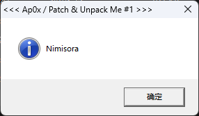

# PE 文件

## PE 文件格式

**PE 文件**（**Portable Executable**）是 Windows 操作系统下使用的可执行文件格式。其中，32 位可执行文件称 PE32，64 位的可执行文件称 PE+ 或 PE32+。

| 种类         | 主拓展名               |
| ---------- | ------------------ |
| **可执行文件**  | EXE, SCR           |
| **库系列**    | DLL, OCX, CPL, DRV |
| **驱动程序系列** | SYS, VXD           |
| **对象文件系列** | OBJ                |

!!! note "严格来讲，除了 OBJ 文件外所有文件都是可执行的，尽管它被视为 PE 文件"

一个 32-bit 的 PE 文件结构大致如下：

```text
+-------------------------------+
|     MS-DOS MZ header          |    -> DOS 头
+-------------------------------+
|     DOS Stub                  |    -> DOS 存根
+-------------------------------+ \
|     PE Signature              |  |
+-------------------------------+  |
|     IMAGE_FILE_HEADER         |  | -> NT 头
+-------------------------------+  |
|     IMAGE_OPTIONAL_HEADER     |  |
+-------------------------------+ /
|     section header #1 (.text) | 
+-------------------------------+ 
|     section header #2 (.data)
+------------------------- 
: 
: 

+------------------------------+ 
|        section #1    (.text) | 
+------------------------------+ 
|        section #2    (.data)
+-------------------- 
: 
: 
```

> 接下来选用普通的 Hello World PE 文件进行演示

### DOS Header

DOS 头和 DOS 存根是微软为了充分考虑 PE 文件对于 DOS 文件的兼容性而设置的，其中 **DOS 头**的结构体如下：

```c
typedef struct _IMAGE_DOS_HEADER
{
     WORD e_magic;              // 4D5A ("MZ")
     WORD e_cblp;
     WORD e_cp;
     WORD e_crlc;
     WORD e_cparhdr;
     WORD e_minalloc;
     WORD e_maxalloc;
     WORD e_ss;
     WORD e_sp;
     WORD e_csum;
     WORD e_ip;
     WORD e_cs;
     WORD e_lfarlc;
     WORD e_ovno;
     WORD e_res[4];
     WORD e_oemid;
     WORD e_oeminfo;
     WORD e_res2[10];
     LONG e_lfanew;             // NT 头相对于文件起始处的偏移
} IMAGE_DOS_HEADER, *PIMAGE_DOS_HEADER;
```

结构体 `IMAGE_DOS_HEADER` 大小为 40B，其中需要注意两个成员：

- `e_magic`: DOS 签名，固定为 `4D5A`，即 ASCII 值 `MZ`
- `e_lfanew`: NT 头 `IMAGE_NT_HEADER` 相对于文件起始处的偏移

![[re_topic2_1.png]]

!!! tip "注意是小段序，因此此处 `e_lfanew` 的值为 `00000080`"

**DOS Stub** 位于 DOS Header 下方，是一个可选项，且大小不固定。DOS 存根由代码与数据混合而成，其中 `40-4D` 区域是一串 16 位的汇编指令。

当程序运行在 32-bit 环境时，OS 不会运行该命令；当在 DOS 环境（16-bit）尝试运行 PE 文件时，则该段指令被执行，作用是输出 "This program cannot be run in DOS mode" 并退出。

![[re_topic2_2.png]]

!!! info "利用该特性可以书写在 MS-DOS 和 Windows 环境中都能运行的程序"

### NT Header

**NT 头**的结构体如下：

```c
typedef struct _IMAGE_NT_HEADERS {
  DWORD                   Signature;         /* +0000h PE 标识 */
  IMAGE_FILE_HEADER       FileHeader;        /* +0004h PE 标准头 */
  IMAGE_OPTIONAL_HEADER32 OptionalHeader;    /* +0018h PE 可选头  */
} IMAGE_NT_HEADERS32, *PIMAGE_NT_HEADERS32;
```

`Signature` 是 PE 文件签名，固定为 `50450000`，对应 ASCII 值 `PE\0\0`

第二个成员 `FileHeader` 也被称为 COFF 头（标准通用文件格式头），表示该文件的大致属性，其结构为：

```c
typedef struct _IMAGE_FILE_HEADER {
  WORD  Machine;                    /* +0004h 目标机器类型 */
  WORD  NumberOfSections;           /* +0006h PE 中节的数量 */
  DWORD TimeDateStamp;              /* +0008h 时间戳 */
  DWORD PointerToSymbolTable;       /* +000ch 指向符号表的指针 */
  DWORD NumberOfSymbols;            /* +0010h 符号表中符号数目 */
  WORD  SizeOfOptionalHeader;       /* +0012h 可选头的大小 */
  WORD  Characteristics;            /* +0014h 文件属性标志 */
} IMAGE_FILE_HEADER, *PIMAGE_FILE_HEADER;
```

- `Machine`: CPU 的机器码，各类具体值可见 [PE 格式 - Win32 apps](https://learn.microsoft.com/zh-cn/windows/win32/debug/pe-format?redirectedfrom=MSDN#machine-types)
	- 其中 Intel 386 或更高版本的处理器和兼容的处理器的机器码为 `0x014c`
- `NumberOfSections`: 节区数量
	- 定义的节区数和实际节区数不同时，将发生运行时错误
- `TimeDataStamp`: 低 32 位表示从 1970 年 1 月 1 日 00:00 到文件创建时经过的秒数
- `PointerToSymbolTable`: 符号表的文件偏移
	- 如果不存在符号表，则为 0
- `NumberOfSymbols`: 符号表中的符号数量
- `SizeOfOptionalHeader`: 可选头 `OptionalHeader` 的大小
	- 在 32-bit 机器上默认是 `0x00E0`，在 64-bit 机器上默认是 `0x00F0`
- `Characteristics`: 文件属性，通过 bit OR 方式组合，一些常见的文件属性标志如下：

```c
// 文件属性标志
#define IMAGE_FILE_RELOCS_STRIPPED          0x0001    // 表示文件不包含重定位信息，只能在原定的基址加载。如果原定基址不可用，加载器会报出错误
#define IMAGE_FILE_EXECUTABLE_IMAGE         0x0002    // 表示文件可执行，如果该位未设置，意味着存在链接器错误
#define IMAGE_FILE_LINE_NUMS_STRIPPED       0x0004    // 不存在行信息
#define IMAGE_FILE_LOCAL_SYMS_STRIPPED      0x0008    // 不存在符号信息
#define IMAGE_FILE_AGGRESSIVE_WS_TRIM       0x0010    // 已废弃
#define IMAGE_FILE_LARGE_ADDRESS_AWARE      0x0020    // 应用可处理大于 2GB 的地址
#define IMAGE_FILE_BYTES_REVERSED_LO        0x0080    // 小尾存储。已废弃
#define IMAGE_FILE_32BIT_MACHINE            0x0100    // 基于 32-bit 体系结构
#define IMAGE_FILE_DEBUG_STRIPPED           0x0200    // 不存在调试信息
#define IMAGE_FILE_REMOVABLE_RUN_FROM_SWAP  0x0400    // 如果映像文件在可移动介质上，完全加载并复制到内存交换文件中
#define IMAGE_FILE_NET_RUN_FROM_SWAP        0x0800    // 如果映像文件在网络介质上，完全加载并复制到内存交换文件中
#define IMAGE_FILE_SYSTEM                   0x1000    // 映像文件是系统文件
#define IMAGE_FILE_DLL                      0x2000    // 映像文件是动态链接库文件
#define IMAGE_FILE_UP_SYSTEM_ONLY           0x4000    // 文件只能在单处理器机器上运行
#define IMAGE_FILE_BYTES_REVERSED_HI        0x8000    // 大尾存储（已废弃）
```

!!! warning "其中需要记住 `0002` (exe) 和 `2000` (dll)"

![[re_topic2_3.png]]

可选头在 PE32 和 PE32+ 不同，我们仅介绍 `IMAGE_OPTIONAL_HEADER32` 的结构：

```c
typedef struct _IMAGE_OPTIONAL_HEADER {
  WORD                 Magic;                            /* +0018h 魔数 */
  BYTE                 MajorLinkerVersion;               /* +001ah 链接器主要版本号 */
  BYTE                 MinorLinkerVersion;               /* +001bh 链接器次要版本号 */
  DWORD                SizeOfCode;                       /* +001ch 所有含代码的节的总大小 */
  DWORD                SizeOfInitializedData;            /* +0020h 所有含已初始化数据的节的总大小 */
  DWORD                SizeOfUninitializedData;          /* +0024h 所有含未初始化数据的节的总大小 */
  DWORD                AddressOfEntryPoint;              /* +0028h 程序入口点RVA */
  DWORD                BaseOfCode;                       /* +002ch 代码节起始RVA */
  DWORD                BaseOfData;                       /* +0030h 数据节起始RVA */
  DWORD                ImageBase;                        /* +0034h 映像文件加载时的首选地址 */
  DWORD                SectionAlignment;                 /* +0038h 内存中节对齐粒度*/
  DWORD                FileAlignment;                    /* +003ch 文件中节对齐粒度 */
  WORD                 MajorOperatingSystemVersion;      /* +0040h 操作系统主要版本号 */
  WORD                 MinorOperatingSystemVersion;      /* +0042h 操作系统次要版本号 */
  WORD                 MajorImageVersion;                /* +0044h 映像文件主要版本号 */
  WORD                 MinorImageVersion;                /* +0046h 映像文件次要版本号 */
  WORD                 MajorSubsystemVersion;            /* +0048h 子系统主要版本号 */
  WORD                 MinorSubsystemVersion;            /* +004ah 子系统次要版本号 */
  DWORD                Win32VersionValue;                /* +004ch 保留。置0 */
  DWORD                SizeOfImage;                      /* +0050h 内存中映像文件的大小 */
  DWORD                SizeOfHeaders;                    /* +0054h 所有头+节表大小 */
  DWORD                CheckSum;                         /* +0058h 映像文件校验和 */
  WORD                 Subsystem;                        /* +005ch 运行映像所需子系统 */
  WORD                 DllCharacteristics;               /* +005eh 映像文件的DLL属性 */
  DWORD                SizeOfStackReserve;               /* +0060h 初始化时的保留的栈大小 */
  DWORD                SizeOfStackCommit;                /* +0064h 初始化时实际提交的栈大小 */
  DWORD                SizeOfHeapReserve;                /* +0068h 初始化时保留的堆大小 */
  DWORD                SizeOfHeapCommit;                 /* +006ch 初始化时实际提交的堆大小 */
  DWORD                LoaderFlags;                      /* +0070h 已废弃 */
  DWORD                NumberOfRvaAndSizes;              /* +0074h 数据目录结构的数量 */
  IMAGE_DATA_DIRECTORY DataDirectory[IMAGE_NUMBEROF_DIRECTORY_ENTRIES];     /* +0078h 指向数据目录中第一个 IMAGE_DATA_DIRECTORY 结构体的指针 */
} IMAGE_OPTIONAL_HEADER32, *PIMAGE_OPTIONAL_HEADER32;
```

我们关注以下几个关键成员：

- `Magic`: 魔数
	- 为 `IMAGE_OPTIONAL_HEADER32` 时为 `10B`
	- 为 `IMAGE_OPTIONAL_HEADER64` 时为 `20B`
- `AddressOfEntryPoint`: 入口点函数相对于映像文件加载基址的偏移（RVA）
	- 对于可执行文件，这是启动地址
	- 对于设备驱动，这是初始化函数地址
- `ImageBase`: 映像文件*优先*被载入的虚拟地址，必须为 64KB 的整数倍
	- 应用程序的默认值为 `0x00400000`
	- DLL 的默认值为 `0x10000000`
		- 因此多个 DLL 被载入时，PE Loader 一定会调整载入地址
- `SectionAlignment`: 内存中的节对齐粒度
	- 默认值与系统的页大小相等
	- 该值必须不小于 `FileAlignment`
- `FileAlignment`: 映像文件中原始数据的对齐粒度
	- 范围在 $2^9$ 到 $2^{16}$ 之间，默认为 $2^9$
	- 如果 `SectionAlignment` 值小于系统页大小，则 `FileAlignment` 必须与该值设置相同
- `SizeOfImage`: 指定在虚拟地址空间占据空间的大小
- `SizeOfHeader`: 整个 PE 头的大小，并且按照 `FileAlignment` 对齐
	- 那么第一节区就位于偏移 `SizeOfHeader` 处
- `Subsystem`: 运行映像文件所需的子系统，最常用的值有：
	- `1`: Driver 文件，即系统驱动（如 ntfs.sys）
	- `2`: GUI 文件，即窗口应用程序（如 notepad.exe）
	- `3`: CUI 文件，即控制台应用程序（如 cmd.exe）
- `NumberOfRvaAndSizes`: 数据目录结构的个数，默认为 `0x00000010`，即 16 个
- `DataDirectory[]`: 数据目录，结构体 `IMAGE_DATA_DIRECTORY` 如下：

```c
typedef struct _IMAGE_DATA_DIRECTORY {
  DWORD VirtualAddress;      /* 数据目录的 RVA */
  DWORD Size;                /* 数据目录的大小 */
} IMAGE_DATA_DIRECTORY, *PIMAGE_DATA_DIRECTORY;
```

其中默认的 16 个数据目录含义为：

```c
// 数据目录
DataDirectory[0] =   EXPORT Directory           // 导入表 RVA 和大小
DataDirectory[1] =   IMPORT Directory           // 导入表 RVA 和大小
DataDirectory[2] =   RESOURCE Directory         // 资源表 RVA 和大小
DataDirectory[3] =   EXCEPTION Directory        // 异常表 RVA 和大小
DataDirectory[4] =   CERTIFICATE Directory      // 证书表 FOA 和大小
DataDirectory[5] =   BASE RELOCATION Directory  // 基址重定位表 RVA 和大小
DataDirectory[6] =   DEBUG Directory            // 调试信息 RVA 和大小
DataDirectory[7] =   ARCH DATA Directory        // 指定架构信息 RVA 和大小
DataDirectory[8] =   GLOBALPTR Directory        // 全局指针寄存器 RVA
DataDirectory[9] =   TLS Directory              // 线程私有存储表 RVA 和大小
DataDirectory[10] =  LOAD CONFIG Directory      // 加载配置表 RVA 和大小
DataDirectory[11] =  BOUND IMPORT Directory     // 绑定导入表 RVA 和大小
DataDirectory[12] =  IAT Directory              // 导入地址表 RVA 和大小
DataDirectory[13] =  DELAY IMPORT Directory     // 延迟导入描述符 RVA 和大小
DataDirectory[14] =  CLR Directory              // CLR数据 RVA 和大小
DataDirectory[15] =  Reserverd                  // 保留
```

!!! abstract "这里需要关注 EXPORT, IMPORT, RESOURCE, TLS，它们是 PE 头中非常重要的部分"

### Section Header

节区头中定义了各节区的属性。节区头的结构体大小均为 40B，其定义如下：

```c
typedef struct _IMAGE_SECTION_HEADER {
  BYTE  Name[IMAGE_SIZEOF_SHORT_NAME];    /* 节区名 */
  union {
    DWORD PhysicalAddress;                /* 物理地址 */
    DWORD VirtualSize;                    /* 虚拟内存中节区大小  */
  } Misc;
  DWORD VirtualAddress;                   /* 虚拟内存中节区 RVA */
  DWORD SizeOfRawData;                    /* 磁盘文件中节区大小 */
  DWORD PointerToRawData;                 /* 磁盘文件中节区 FOA */
  DWORD PointerToRelocations;             /* 指向重定位表的指针 */
  DWORD PointerToLinenumbers;             /* 指向行号表的指针 */
  WORD  NumberOfRelocations;              /* 重定位入口数量 */
  WORD  NumberOfLinenumbers;              /* 行号数量 */
  DWORD Characteristics;                  /* 节区属性 */
} IMAGE_SECTION_HEADER, *PIMAGE_SECTION_HEADER;
```

我们需要关注以下几个重要成员：

- `VirtualSize`: 内存中节区的大小
- `VirtualAddress`: 内存中节区的起始地址（RVA）
- `SizeOfRawData`: 磁盘文件中节区大小
- `PointerToRawData`: 磁盘中节区起始位置
- `Characteristics`: 节区属性，通过 bit OR 方式组合，一些常见的节区属性标志如下：

```c
// 节区属性
#define IMAGE_SCN_CNT_CODE                0x00000020  // 节区包含代码
#define IMAGE_SCN_CNT_INITIALIZED_DATA    0x00000040  // 节区包含已初始化数据
#define IMAGE_SCN_CNT_UNINITIALIZED_DATA  0x00000080  // 节区包含未初始化数据
#define IMAGE_SCN_LNK_NRELOC_OVFL         0x01000000  // 节区包含扩展的重定位项
#define IMAGE_SCN_MEM_DISCARDABLE         0x02000000  // 节区可根据需要丢弃，如 .reloc 在进程开始后被丢弃
#define IMAGE_SCN_MEM_NOT_CACHED          0x04000000  // 节区不会被缓存
#define IMAGE_SCN_MEM_NOT_PAGED           0x08000000  // 节区不可分页
#define IMAGE_SCN_MEM_SHARED              0x10000000  // 节区可共享给不同进程
#define IMAGE_SCN_MEM_EXECUTE             0x20000000  // 节区可作为代码执行
#define IMAGE_SCN_MEM_READ                0x40000000  // 节区可读
#define IMAGE_SCN_MEM_WRITE               0x80000000  // 节区可写
```

![[re_topic2_4.png]]

### IAT

**Import Address Table** 用于记录程序正在使用库中的哪些函数。为了学习 IAT 的相关知识，我们需要先了解 DLL 的概念。

DLL 是一种动态库，加载 DLL 的方式有*显式链接*和*隐式链接*两种，分别对应着“使用时才加载”和“一开始就全部加载”。IAT 的机制与后者相关。

例如对于 hello.exe 中，调用 MessageBoxA API 的汇编语句，我们可以看到它采用间接调用地址 `0x3471BC` 处的值 `0x771ED760` 来实现。其中地址 `0x3471BC` 位于 IAT 内存区域，而 `0x771ED760` 即加载到进程中的 MessageBoxA 函数地址（位于 USER32 库中）。

![[re_topic2_5.png]]

由此，我们可以固定使用 `0x3471BC` 作为该函数的调用入口，而在 `[0x3471BC]` 处放置该函数实际被载入地址，以此来适应不同版本的 DLL 以及 DLL 重定位。

!!! note "EXE 文件通常直接被加载到自身 ImageBase 处，但 DLL 不能保证"

IAT 使用 `IMAGE_IMPORT_DESCRIPTOR` 作为结构体：

```c
typedef struct _IMAGE_IMPORT_DESCRIPTOR
{
    union {
        DWORD   Characteristics;
        DWORD   OriginalFirstThunk;     // INT 的地址 (RVA)
									    // INT: Import Name Table
    } DUMMYUNIONNAME;
    DWORD   TimeDateStamp;
    DWORD   ForwarderChain;             // 第一个被转向的API的索引
    DWORD   Name;                       // 库名称的地址 (RVA)
    DWORD   FirstThunk;                 // IAT 的地址 (RVA)
} IMAGE_IMPORT_DESCRIPTOR;

// INT 和 IAT 的结构体
typedef struct _IMAGE_THUNK_DATA32
{
    union {
        DWORD ForwarderString;      // 转发字符串的RAV
        DWORD Function;             // 被导入函数的地址
        DWORD Ordinal;              // 被导入函数的序号
        DWORD AddressOfData;        // 指向输入名称表 PIMAGE_IMPORT_BY_NAME
    } u1;
} IMAGE_THUNK_DATA32;

// INT 和 IAT 各项的结构体
typedef struct _IMAGE_IMPORT_BY_NAME
{
    WORD    Hint;          // 函数序号
    CHAR   Name[1];        // 导入函数的名称
} IMAGE_IMPORT_BY_NAME, *PIMAGE_IMPORT_BY_NAME;
```

每导入一个库，就会创建一个 `IMAGE_IMPORT_DESCRIPTOR` 结构体，这些结构体构成了数组，并且最后以一个 NULL 结构体结尾。

![[re_topic2_6.png]]

实际在被 PE Loader 装载进内存时，IAT 的内容会被修正为函数入口地址：

![[re_topic2_7.png]]

我们之前学过，*NT Header* 中的可选头中，`DataDirectory[1]` 记录了 IAT 的 RVA 和 Size。对于我的 hello.exe，IAT 的 RVA 为 `0x7000`，Size 为 `1280`。

根据 *Section Header*，我们找到了 `7000h` 应位于节区 `.idata` 中，它的 `VirtualAddress`(RVA) 为 `7000h`，`PointerToRawData` 为 `3000h`，节区大小 `VirtualSize` 为 `500h`。因此计算可得 IAT 表在磁盘中的地址(RAW)为：

$$
7000h-7000h+3000h=3000h
$$

我们尝试追踪 `3000h` 处第一个库的 `IMAGE_IMPORT_DESCRIPTOR` 结构体：

![[re_topic2_12.png]]

| 磁盘偏移  | 成员                   | RVA        | RAW    | 文件内位置                 |
| ----- | -------------------- | ---------- | ------ | --------------------- |
| 3000h | `OriginalFirstTrunk` | `00007064` | `3064` | ![[re_topic2_9.png]]  |
| 3004h | `TimeDataStamp`      | `00000000` | -      |                       |
| 3008h | `ForwarderChain`     | `00000000` | -      |                       |
| 300Ch | `Name`               | `0000742C` | `342C` | ![[re_topic2_8.png]]  |
| 3010h | `FirstTrunk`         | `00007114` | `3114` | ![[re_topic2_10.png]] |

对于 `Name`，我们找到其 RAW 位置的库名称为 `libgcc_s_dw2-1.dll`。

我们的确看到了文件中 INT 和 IAT 各项值均相同。我们进一步跟踪 INT 的第一个表项值 `71C4` 所对应的 RAW 值 `31C4` 处，可以发现导入的 API 函数名称为 `register_frame_info`：

![[re_topic2_11.png]]

### EAT

**Export Address Table** 是库文件让不同的应用程序准确计算其导出函数的起始地址的关键。与 IAT 不同，一个 PE 文件中仅有一个 `IMAGE_EXPORT_DESCRIPTOR` 结构体，而不是一个数组。

!!! info "这是因为 PE 文件可以导入多个库，但只能作为一个库导出"

`IMAGE_EXPORT_DESCRIPTOR` 结构体的定义如下：

```c
typedef struct _IMAGE_EXPORT_DIRECTORY
{
    DWORD   Characteristics;       // 保留,恒为0x00000000
    DWORD   TimeDateStamp;         // 文件的产生时间戳
    WORD    MajorVersion;          // 主版本号
    WORD    MinorVersion;          // 次版本号
    DWORD   Name;                  // 指向文件名的RVA
    DWORD   Base;                  // 导出函数的起始序号
    DWORD   NumberOfFunctions;     // 导出函数总数
    DWORD   NumberOfNames;         // 具名导出函数的总数
    DWORD   AddressOfFunctions;    // 导出函数地址表的RVA
    DWORD   AddressOfNames;        // 函数名称地址表的RVA
    DWORD   AddressOfNameOrdinals; // 函数名序号表的RVA
} IMAGE_EXPORT_DIRECTORY, *PIMAGE_EXPORT_DIRECTORY;
```

![[re_topic2_13.png]]

API `GetProcAddress()` 用于从库的 EAT 中获取指定 API 地址，其具体的操作原理为：

1. 利用 `AddressOfNames` 成员转到“函数名称数组”
2. “函数名称数组”中存储着字符串地址，通过比较字符串查找指定的函数名称，此时数组的索引为 `name_index`
3. 利用 `AddressOfNameOrdinals` 成员转到“序号数组”
4. 通过 `name_index` 在“序号数组”中找到相应的 ordinal 值
5. 利用 `AddressOfFunctions` 成员转到 EAT
6. 通过 ordinal 值获取指定函数的起始地址

!!! note "`GetProcAddress()` 即接受函数名，也接受函数序号"
	- `pFunc = GetProcAddress("TestFunc");`
	- `pFunc = GetProcAddress(4);`

*NT Header* 中的可选头中，`DataDirectory[0]` 记录了 EAT 的 RVA 和 Size。对于我本机的 kernel32.dll，EAT 的 RVA 为 `0xA3070`，Size 为 `0xEB68`。

查询 *Section Header* 后，得到 EAT 位于节区 `.rdata` 中，它的 `VirtualAddress` 为 `86000h`，`VirtualSize` 为 `36D1Ah`，`PointerToRawData` 为 `86000h`。

经过换算，RVA `0xA3070` 对应了 RAW `0xA3070`，我们在该地址处寻找 `IMAGE_EXPORT_DIRECTORY` 结构体：

![[re_topic2_14.png]]

| 磁盘偏移    | 成员                      | 值          | RAW       |
| ------- | ----------------------- | ---------- | --------- |
| 0A3070h | `Characteristics`       | `00000000` | -         |
| 0A3074h | `TimeDataStamp`         | `4D2D2813` | -         |
| 0A3078h | `MajorVersion`          | `0000`     | -         |
| 0A307Ah | `MinorVersion`          | `0000`     | -         |
| 0A307Ch | `Name`                  | `000A7260` | `0xA7260` |
| 0A3080h | `Base`                  | `00000001` | -         |
| 0A3084h | `NumberOfFunctions`     | `00000694` | -         |
| 0A3088h | `NumberOfNames`         | `00000694` | -         |
| 0A308Ch | `AddressOfFunctions`    | `000A3098` | `0xA3098` |
| 0A3090h | `AddressOfNames`        | `000A4AE8` | `0xA4AE8` |
| 0A3094h | `AddressOfNameOrdinals` | `000A6538` | `0xA6538` |

首先查看 `Name` 处的内容，的确是 KERNEL32.dll：

![[re_topic2_15.png]]

然后查看函数名称数组 `AddressOfNames`，每 4B 对应了一个函数名称的 RVA，总共 `0x694` 个函数：

![[re_topic2_16.png]]

我们以函数 `ActivateActCtx` 为例，它位于地址 `A:72D9` 处，即函数名称数组的第三个：

![[re_topic2_17.png]]

接下来我们查询 `AddressOfNameOrdinals` 数组，一个 ordinal 是 2B，因此得到函数 `ActivateActCtx` 的 ordinal 为 `0002`：

![[re_topic2_18.png]]

最后查询 `AddressOfFunctions`，得到 ordinal=2 处的 RVA 为 `00037D20`：

![[re_topic2_19.png]]


该 dll 文件的 `ImageBase` 为 `180000000h`，因此函数 `ActivateActCtx` 理论上应位于地址 `180037D20h` 处。实际运行中，加载器可能会将其重定位到别的基址上，例如如下 `00007FF96EB00000`，则加上 RVA 偏移后的地址为 `00007FF96EB37D20`，验证正确：

![[re_topic2_20.png]]


!!! danger "我使用的是路径 `System32` 下的 `kernel32.dll`，要使用 x64dbg 进行调试"
	如果使用 32-bit 调试器（例如 ollydbg 和 x32dbg），则系统会自动重定向加载 `SysWOW64` 下的 `kernel32.dll`，因此会出现与计算不符的情况。
	
	![[re_topic2_21.png]]

## 运行时压缩

**Run Time Packer** 针对 PE 文件进行了压缩，在运行时压缩文件运行时在内存中解压缩并执行。运行时压缩文件无需额外的解压程序，其内部就包含了解压所需的程序，其文件大小更小，但是每次运行均需调用解码程序。

!!! note "另一方面，压缩器还可用于隐藏 PE 文件内的代码及资源"

为了保护 PE 文件免受代码逆向分析，在 PE 压缩器的基础上又诞生了 **PE 保护器**（Protector）。它不仅对文件进行了运行时压缩，还应用了多种防止代码逆向分析的技术，例如反调试、反模拟、代码混乱、多态代码、垃圾代码、调试器监控等。

!!! info "经保护器处理后的代码可能比原始文件还大一些，调试起来非常困难"

接下来我们使用压缩器 [upx](https://github.com/upx/upx/releases) 进行测试，对 hello.exe 进行压缩：

![[re_topic2_22.png]]

!!! note "可以看见文件大小从 105239 变为了 57623，节区数从 18 变为 3"
	三个节区名分别为 `UPX0`, `UPX1`, `.rsrc`，并且第一个节区 `UPX0` 的 `SizeOfRawData` 的值为 0，即为空节区。该空节区用来存放解压后的代码，而解压缩程序和压缩的源代码都位于第二个节区 `UPX1` 中。

使用 OllyDbg 调试压缩后的 PE 程序，其 EntryPoint 处代码为：

```c
// 实际上 EP 位于 UPX1 的末端部分
000B0AA0 > $  60            pushad
000B0AA1   .  BE 15A00A00   mov     esi, 000AA015
000B0AA6   .  8DBE EB6FFEFF lea     edi, [esi+0xFFFE6FEB]
```

其首先将所有 32-bit 寄存器保存到栈中，然后分别为 `esi` 和 `edi` 赋值 `UPX1` 的起始地址和 `UPX0` 的起始地址。

!!! quote
	我们知道，`si` 意为 source index, `di` 意为 destination index，因此后面的操作实际上是将 `esi` 处的数据（解压并）复制到 `edi` 处。
	
	![[re_topic2_23.png]]

略过中间的解压步骤，我们最终可以看见接近末尾有段代码从栈中弹出了所有保存的寄存器，然后无条件跳转到了 OEP 处：

```c
000B0C66   .  61            popad
000B0C67   .  8D4424 80     lea     eax, [esp-0x80]
000B0C6B   >  6A 00         push    0x0
000B0C6D   .  39C4          cmp     esp, eax
000B0C6F   .^ 75 FA         jnz     short 000B0C6B
000B0C71   .  83EC 80       sub     esp, -0x80
000B0C74   .- E9 7707FEFF   jmp     000913F0       // JUMP TO OEP
```

!!! danger "解压涉及解压缩代码、恢复源代码 `call/jmp` 类指令的跳转地址、设置 IAT 等循环"

事实上，UPX 的解压缩代码始终位于 `pushad` 和 `popad` 之间，为了更快找到程序的 OEP，我们可以在开头执行完 `pushad` 后观察栈顶的地址，并在该地址设置硬件断点。

OllyDbg 中，具体的设置方法为在左下角的 Dump 界面中跳转到栈顶地址，右键菜单中选择“*断点->硬件访问->Byte*”，然后继续运行程序即可。

!!! abstract "硬件断点会停在访问该地址的指令的*下一条指令*"


## 基址重定位

通常对于 DLL、SYS 文件，若其被加载时 `ImageBase` 处已经被占据，那么 PE Loader 会将其加载到其它未被占用的空间，这就是 PE 文件重定位。

Windows Vista 版本后引入了 *ASLR* 机制，每次运行 EXE 文件时，其也会被加载到随机地址，从而增强了系统安全性。

PE Loader 装载时的重定位主要是对应用程序中硬编码的地址进行修正，具体修正公式即为：

$$
\text{Address}-\text{ImageBase} + \text{实际 Base}
$$

其中最关键的是找到哪些地址是被硬编码的，查找过程会使用内部的 **Relocation Table**，它通常在编译/链接过程中就被提供。

我们能看到 PE Header 中的 `DataDirectory[5]` 即为重定位表的 RVA 和 Size。继续以我的 hello.exe 为例，它的基址重定位的 `VirtualAddress` 为 `B000h`，`Size` 为 `248h`。

查找 Section Header，找到该 RVA 位于节区 `.reloc` 中，该节区的 `VirtualAddress` 为 `B000h`，`PointerToRawData` 为 `4000h`。计算可得重定位表的 RAW 为 `4000h`。

基址重定位表每个表项的结构 `IMAGE_BASE_RELOCATION` 如下：

```c
typedef struct _IMAGE_BASE_RELOCATION
{   
    DWORD   VirtualAddress;                      // 需重定位数据的起始RVA   
    DWORD   SizeOfBlock;                         // 本结构与TypeOffset总大小 
    WORD    TypeOffset[1];                       // 原则上不属于本结构 
} IMAGE_BASE_RELOCATION; typedef  IMAGE_BASE_RELOCATION UNALIGNED IMAGE_BASE_RELOCATION;
```


![[re_topic2_24.png]]

| RVA   | 数据         | 注释               |
| ----- | ---------- | ---------------- |
| 4000h | `00001000` | `VirtualAddress` |
| 4004h | `00000154` | `SizeOfBlock`    |
| 4008h | `3018`     | `TypeOffset`     |
| 400Ah | `3020`     | `TypeOffset`     |
| 400Ch | `302A`     | `TypeOffset`     |
| 400Eh | `3034`     | `TypeOffset`     |
|       | ...        |                  |
| 4152h | `3FF2`     | `TypeOffset`     |
| 4154h | `00002000` | `VirtualAddress` |
|       | ...        |                  |

其中 `TypeOffset` 字段，前 4 位表示 `Type`，后 12 位表示 `Offset`。对于 PE，`Type` 通常为 3（`IMAGE_REL_BASED_HIGHLOW`）；对于 PE+，`Type` 值通常为 A（`IMAGE_REL_BASED_DIR64`）。

我们以该表项的第一个 `TypeOffset` 为例，其真实 RVA 为 `1000h` + `18h` = `1018h`，我们在 OllyDbg 中查看 RVA `1018h` 处是否存在一个硬编码的地址：

```text
Executable modules, 条目 0
 基址=00790000
 大小=0001F000 (126976.)
 入口=007913F0 hello.<ModuleEntryPoint>
 名称=hello
 路径=\RE\hello.exe
```

那么 RVA `1018h` 就相当于地址 `791018h`，查看该地址处的汇编指令：

![[re_topic2_25.png]]

由于指向的是地址，而不是指令，因此 `791018h` 处就是指令 `cmp word ptr [0x790000], 0x5A4D` 中的 `0x7900`，验证正确。

!!! info "重定位表也以一个 NULL 结构体结束"

## 内嵌补丁

对于加密文件、运行时解压缩文件等难以直接修改指定代码的文件，常常通过**内嵌补丁**（**Inline Code Patch**）的方式打补丁，其中插入并运行的代码被称为**洞穴代码**（**Code Cave**）

![[re_topic2_26.png]]

下载示例文件[unpackme#1.aC.exe](https://github.com/reversecore/book/blob/master/%EC%8B%A4%EC%8A%B5%EC%98%88%EC%A0%9C/02_PE_File_Format/20_%EC%9D%B8%EB%9D%BC%EC%9D%B8_%ED%8C%A8%EC%B9%98_%EC%8B%A4%EC%8A%B5/bin/unpackme%231.aC.exe)，我们的任务要求是更改第一个对话框中的文字。

用调试器运行该文件，其直接在 EP 处调用解密函数（`004010E9`）：

```asm
00401000   .  60            pushad
00401001   .  E8 E3000000   call    004010E9
```

我们进入解密函数，发现其传入一个参数 `004010F5` 给下一层解密函数（`0040109B`）并嵌套调用：

```asm
004010E9  /$  B8 F5104000   mov     eax, 004010F5
004010EE  |.  50            push    eax
004010EF  |.  E8 A7FFFFFF   call    0040109B
004010F4  \.  C3            retn
```

接着进入该解密函数，可以看到开头有段解密循环，对 `004010F5` 处的数据进行与 `0x44` 的异或运算，总共执行 `0x154` 次，即该循环操作的对象是 `004010F5` - `00401248` 处的数据。

![[re_topic2_27.png]]

完成该操作后，继续将 `004010F5` 作为参数调用下一层解密函数（`004010BD`），我们接着进入该函数：

![[re_topic2_28.png]]

该函数一眼即可见有两处解密循环。其中第一处循环对 `00401007` - `00401085` 处的数据进行了与 `0x7` 的异或运算；第二处循环对 `004010F5` - `00401248` 处的数据进行了与 `0x11` 的异或运算。最后恢复 `eax` 并返回。

返回后，继续将 `004010F5` 作为参数调用下一层解密函数（`00401039`）：

![[re_topic2_29.png]]

不过该函数并没有对数据部分进行操作，而是对解压出来的数据进行 CrC 冗余校验，如果校验不通过则会报错。

最后，来到解压后的主函数附近，看到程序传递给 MessageBox 和 Dialog 的两个参数的地址分别为 `0040110A` 和 `00401123`，这也是我们想要修改的数据：

![[re_topic2_30.png]]

根据之前的分析，这两个数据都位于二次加密的区域，我们很难直接对加密后的数据进行修改，因此采用内嵌补丁的方式。

综合来看，该程序的运行方式如下：

![[re_topic2_31.png]]

其中只有 `[B]` 会被校验，我们可以尝试修改 `[A]` 中的 `JMP 40121E` 为跳转到我们自己的补丁代码处。

为此，我们需要寻找一个空白区域作为我们的洞穴代码书写出。观察 Section Header，可以看到第一个节区 `.text` 占据了 RVA `1000` - `2000`，占据了 RAW  `400` - `800`，但是实际使用的 `VirtualSize` 只有 280。因此，文件中 `680` - `800` 这一段是空白的，我们就选择在这里书写。

我们现在调试器中对该段进行书写，观察得程序被加载到基址 `400000`，因此我们希望书写的空白段位于 `401280` - `401400` 处。

![[re_topic2_32.png]]

然后，我们要修改 `401083` 处的 `jmp 40121E` 为 `jmp 401280`：

```asm
00401083     E9 F8010000   jmp     00401280
```

由于区域 `[A]` 需要经过异或 7 的加密解密处理，我们也对其进行处理后得到加密后的机器码 `EE FF 06`：

![[re_topic2_33.png]]

!!! note "后面的 `0000` 并不在加密范围内，只加密到 `401085`"

完成上述修改后，在右键菜单中选择“复制到可执行文件->所有修改”即可得到补丁完的可执行文件，执行效果如下：

<p align="center">
  
  
</p>

