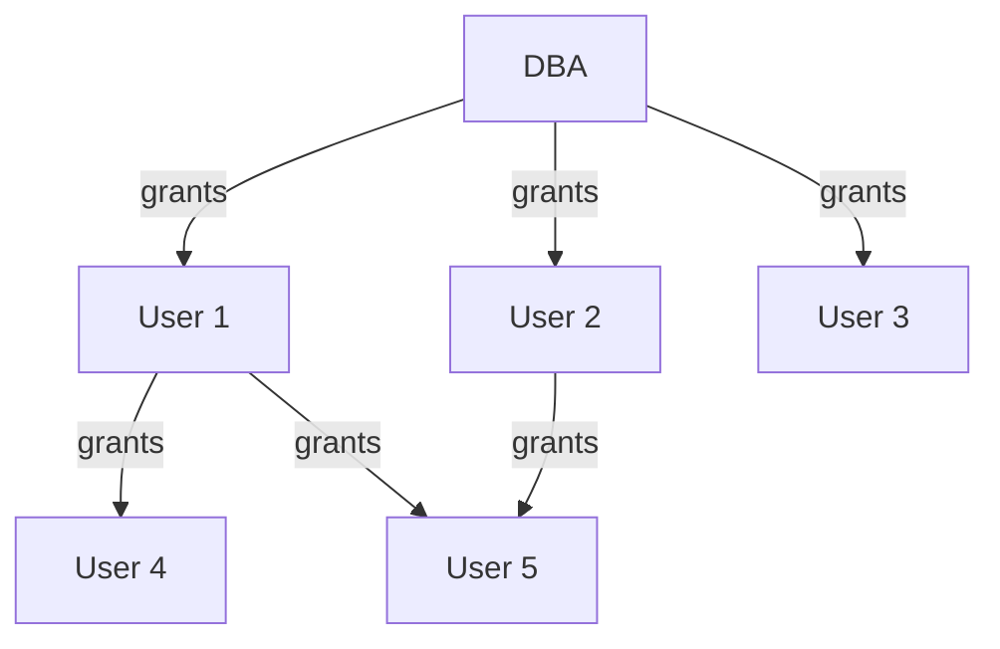

# SQL

!!! quote "一定要记住查询语句的执行顺序，才能理清逻辑"
	$$from\rightarrow where \rightarrow group(aggregate)\rightarrow having \rightarrow select \rightarrow order\ by$$

## Overview

SQL(Sequel)是一个语言规范，最初由 IBM 设计。不过很多 DBMS 并不会完全按照规范设计它们的语言，每个人都想要将它们的 feature 加入 SQL 后续的更新中。

!!! warning "我不想我的 SQL 语句能被别的厂商直接使用（）"

按照标准符合度(Conformance Levels)，可以分为四类：

- Entry Level SQL 入门级
- Transitional SQL 过渡级
- Intermediate SQL 中间级
- Full SQL 完全级

到了现在，已经没有 DBMS 产品会实现 FULL LEVEL 的标准符合度了。

作为一个关系型语言，SQL 主要由以下三个方面组合而成：

- **Data Manipulation Language** (DML)
	- 数据操作语言，即检索数据或修改数据的命令
	- `select ... from ...`
	- `insert`, `delete`, `update`
- **Data Defination Language** (DDL)
	- 数据定义语言，可涉及到索引、命名空间、触发器、函数等，通常为数据库声明元数据
	- `create table`, `alter table`, `drop table`
	- `create index`, `drop index`
	- `create view`, `drop view`
	- `create trigger`, `drop trigger`
- **Data Control Language** (DCL)
	- 数据控制语言，关于安全和类似内容的规范
	- `grant`, `revoke`

![[SQLOverview1.png]]

## Data Definition Language

一个典型的 DDL 语句如下：

```sql
CREATE TABLE branch
			(branch_name char(15) not null,
			branch_city  varchar(30),
			assets       numeric(8,2),
			primary key(branch_name),
			foreign key(...) references ...(...))
```

SQL 的 Domain Type 大体有以下几类：

- `char(n)`: 用户指定的定长字符串
	- C语言中字符串一定以 0 结尾，但是 DB 中并不需要
- `varchar(n)`: 用户指定最大长度的可变长度字符串
- `int`: 整数，根据机器的不同指定的范围不同
- `smallint`: 整数，比 `int` 范围更小
- `numeric(p,d)`: Fixed Point Number，p 表示有效数字位数，d 表示小数点后多少位
	- 例如，`numeric(3,1)` 允许 44.5，但不允许 444.5 或者 0.32
- `real, double`: 浮点数，根据机器的不同精度不同
- `float(n)`: 浮点数，由用户指定最小精度
- `null values`: 空
- `date`: 包含年(4 digit)、月、日
	- E.g. `2007-2-27`
- `time`: Time of day, in hours, minutes, and seconds
	- E.g. `11:18:16` or `11:18:16.28`
- `timestamp`: 时间戳，通常是 Data + Time
	- E.g. `2007-2-27 11:18:16.28`
- Large Object Types，用来存储大文件，如 `blob(20MB)`
	- `blob`: Binary Large Object
	- `clob`: Character Large Object

!!! info "SQL 有许多函数用来处理各种类型的数据及其类型转换，但各数据库系统中函数的标准化程度不高"

除了在 `CREATE` 语句中指定 Domain Type 外，还需要加入必要的 Integrity Constraints 来确保数据库的完整性：

- `not null`: 要求非空
- `default`: 设定缺省值
- `check(p)`: 检测谓词 p 是否成立
- `Primary Key(A1, A2,...)`: 括号内不能为空、不能有重复 Keys
- `Foreign Key(A1, A2,...) references r`: 引用对应表的主键

```sql
CREATE table account(
	...
	FOREIGN KEY(branch_name) REFERENCES branch(branch_name)
		-- 在违反 referential integrity 的情况下：
		[on delete cascade] -- branch删了，则同时删掉account
		[on update cascade] -- branch更新，则同时更新account
)
```

!!! warning "Referential Integrity 的检测只在一个事务结束时进行，因此事务中间可以暂时违反"

SQL 还支持用户自定义 Types 或 Domain：

```sql
-- CREATE NEW TYPE
CREATE type person_name AS varchar(20)
CREATE table student(sno char(10) PRIMARY KEY,
					 sname person_name
);
DROP type person_name

-- CREATE NEW DOMAIN
CREATE domain Dollars AS numeric(12, 2) NOT NULL
CREATE table employee(eno char(10) PRIMARY KEY,
					  salary Dollars
)
```

!!! info "区别在于，`DOMAIN` 允许添加约束"

```sql
-- 完全删除 Relation branch
DROP TABLE branch;

-- 为 loan 添加新属性 loan_date
-- 所有新增属性的初始值均为 null
ALTER TABLE loan ADD loan_date date;

-- 删除 loan_date 属性
-- 很多 DBMS 不支持这一功能
ALTER TABLE loan DROP loan_date

-- 调整属性的 domain
ALTER TABLE branch MODIFY(branch_name char(30), assets not null)
```

!!! warning "不要轻易使用 DROP 指令，DELETE 起码还会把 SCHEMA 留下来，DROP 了什么都没了"

```sql
CREATE INDEX index_user_id ON user_t (user_id)
```

在不读取整个表的情况下，索引使得数据库应用程序可以更快查找数据，并且是*用户不可见的*。

由于索引本身也需要更新，更新一个带索引的表要比没有索引的同一表消耗更多时间，因此，理想的做法是只在常常被搜索的 Column 上建立索引。

!!! info "To Drop an index"
	```sql
	DROP INDEX index_user_id ON user_t
	```

## Basic Structure

```sql
SELECT A1, A2, ..., An
FROM r1, r2, ..., rm
WHERE P
```

等价于逻辑代数：

$$
\Pi_{ A_1, A_2,..., A_n}( \sigma_{ P} (r_1 \times r_2 \times ... \times r_n))
$$

!!! note "SQL 允许 Relation 中出现重复元组，使用 `distinct` 关键字来强制筛选"
	```sql
	SELECT DISTINCT branch_name FROM loan;
	SELECT ALL branch_name FROM loan; -- 默认不加就是 all
	```

```sql
SELECT customer_name, borrower.loan_number as loan_id
FROM borrower, loan
WHERE borrower.loan_number = loan.loan_number;
```

在 SQL Server 中，可以使用等于号来代替上式的 `as`

SQL 还提供 String-Matching Operator，通常在 `where` 语句中使用 `LIKE` 运算符：

- `%` : 匹配任意字串
- `_` : 匹配任意单字符

## Set Operations

在 SQL 中，集合操作有 `UNION`, `INTERSECT`, `EXCEPT`，分别对应着并集 $\cup$，交集 $\cap$，以及差集 $-$。与其他操作不同的是，set operations 会自动隐去重复的元素，如果我们想保留重复元组，则需使用 `UNION ALL` 等关键字。

!!! question "Suppose a tuple occurs m times in r and n times in s, then it occurs:"
	- $m+n$ times in `r UNION ALL s`
	- $\min (m,n)$ times in `r INTERSECT ALL s`
	- $\max (0, m-n)$ times in `r EXCEPT ALL s`

<font style="font-weight: 1000;font-size: 20px" color="red">Example. Find all customers who have an account but no loan.</font>

```sql
(SELECT customer_name FROM depositor)
EXCEPT
(SELECT customer_name FROM borrower)
```

!!! note "注意不同 DBMS 之间差别，例如 Oracle 使用 `MINUS` 代替 `EXCEPT`，SQL Server 2000 只支持 `UNION` 和 `UNION ALL` 等"


## Aggregate Functions

!!! quote "带聚合函数的 `SELECT` 之后只能跟着 `GROUP BY` 子句中的属性或者聚合函数"

<font style="font-weight: 1000;font-size: 20px" color="red">Example. Find the average account balance for each branch</font>

```sql
SELECT branch_name, avg(balance) AS avg_bal
FROM account
GROUP BY branch_name
```

由于 `WHERE` 的计算顺序比聚合函数前，所有当执行 `WHERE` 判断时聚合函数还没有得到结果，因此我们不能在 `WHERE` 中加入聚合函数。相对的，我们使用 `HAVING` 关键字来作为代替：

<font style="font-weight: 1000;font-size: 20px" color="red">Example. Find the names of all branches located in city Brooklyn where the average account balance is more than $1,200</font>

```sql
SELECT A.branch_name, avg(balance)
FROM account AS A, branch AS B
WHERE A.branch_name = B.branch_name AND
	branch_city = 'Brooklyn'
GROUP BY A.branch_name
HAVING avg(balance) > 1200;
```

除了 `COUNT` 的聚合函数默认忽略 Null Values，除非该值全部为 `null`，此时也会返回 `null`。

!!! note "Null Values"
	任意带 `null` 的算术计算结果都是 `null`，任意带 `null` 的逻辑比较结果都是 `unknown`。此外，三种带 `unknown` 的逻辑计算结果为：
	![[unknownoperations.png]]
	
	同时，作为 `WHERE` 子句中的谓词，需要使用 `WHERE amount is not null` 的形式来判断 null values，而不能直接用等于号

!!! question "关键字 `rollup`"
	`group by rollup(A,B,C)` 能够自动生成多级别的汇总数据：
	
	- **按 (A, B, C) 分组**，计算最详细的分组统计。
	- **按 (A, B) 分组**，忽略 C，计算 B 级别的汇总。
	- **按 (A) 分组**，忽略 B 和 C，计算 A 级别的汇总。
	- **整体汇总**，不按任何列分组，计算全局统计。
	
	??? example "对以下表执行以下 SQL 语句"
		![[rollupexample.png]]
		
		```sql
		SELECT building, room_number, time_slot_id, COUNT(*)
		FROM r
		GROUP BY ROLLUP (building, room_number, time_slot_id);
		```
		
		得到结果：
		
		![[rollupexample2.png]]


## Nested Query

我们知道 `FROM` 甚至 `WHERE` 子句中都可以以一张表作为对象，而我们 `SELECT` 语句得到的结果就是一张表，因此我们完全可以进行嵌套查询，下面是一个简单例子：

```sql
SELECT distinct customer_name
FROM borrower
WHERE customer_name not in (SELECT customer_name
							FROM depositor);
```

那么，如果我们想查找各个 branch 中 balance 最大的账户，该如何构造嵌套查询？

```sql
SELECT account_number AS AN, balance
FROM account AS A
WHERE balance >= (SELECT max(balance)
				 FROM account AS B
				 WHERE A.branch_name = B.branch_name)
ORDER BY balance
```

分析语序，此处相当于一个两层嵌套循环，先从外层 `A` 取出一个 `branch_name`，然后找出内层所有相同 `branch_name` 的元组，计算最大值，再回到外层进行比较。这样唯一符合的结果就是该 `branch_name` 中 balance 最大的账户了。

除此之外，SQL 还有一种 set comparison，分别是 `SOME` 和 `ALL` 关键词：

=== "SOME"
	![[setsome.png]]
=== "ALL"
	![[setall.png]]

## VIEW

VIEW 并不占用实际空间，是一张更方便查看的逻辑表，同时也可以被当作正常表来访问（以及嵌套查询）。

下面的 SQL Server 语句创建了一个用于统计各个用户的贴数的 VIEW：

```sql
CREATE VIEW post_number AS
(SELECT user_id, COUNT(post_id) AS post_count
FROM posts GROUP BY user_id);
```

!!! info "使用 `DROP VIEW <V_NAME>` 来删除 VIEW"

我们甚至可以对 VIEW 进行 Modification，DBMS 会尽可能将其“翻译”为对基表的操作。但我们尽量不要这么做。只有行列视图可以更新数据。

!!! question "行列视图"
	建立在单个基本表上的视图，且视图的列对应表的列，称为行列视图。

通过 `WITH` 关键字，我们可以建立一个 LOCAL VIEW，使得嵌套查询变得更加美观：

```sql
-- Find all account with maximum balance
WITH max_balance(value) AS
	SELECT max(balance)
	FROM account
SELECT account_number
FROM account, max_balance  -- USE LOCAL VIEW
WHERE account.balance = max_balance.value
```

## Modification

Modification 即我们熟识的增删改 `INSERT`, `DELETE`, `UPDATE`:

```sql
-- 插入
insert into table_name values();

-- 删除
delete from table_name where P;

-- 修改
update r
set attribute = ...
where P

-- 修改(case)
update r
set attribute = case
    when ... then ...
    when ... then ...
    ...
    else ...
end
```

## Join Operation

连接操作是一个二元运算符，可以分为自然连接和非自然连接两类，区别在于 Natural 自动以同名属性相等作为连接条件，而非自然连接可以使用 `ON`或`USING` 关键字自定义条件：

```sql
-- 自然连接
R NATURAL {INNER JOIN, LEFT JOIN, RIGHT JOIN, FULL JOIN} S

-- 非自然连接
R {INNER JOIN, LEFT JOIN, RIGHT JOIN, FULL JOIN} ON <condition>
												 USING <columns>
```

外连接（非 `INNER JOIN`）如果找不到对应的连接对应关系，也要加入到结果中：

![[outerjoinex1.png]]

!!! warning "使用 `ON` 的非自然连接允许不同名属性的比较，同时结果不消去同名属性"
	![[outerjoinwithon.png]]

<font style="font-weight: 1000;font-size: 20px" color="red">Example. Find all customers who have either an account or a loan (but not both) at the bank</font>

找到只拥有 account 或 loan 的 customers。

```sql
SELECT customer_name
FROM (depositor natural full outer join borrower)
WHERE account_number is NULL OR loan_number is NULL;
```

## Assertions & Triggers

assertion 也是确保数据库 integrity 的方式。当我们设置一个 assertion 后，DBMS 会在每一次更新后检测：

```sql
CREATE ASSERTION <assertion_name>
	CHECK <predicate>
```

如果 `CHECK` 不满足，则会拒绝这次更改。

Triggers 则是 DBMS 在某些特定的 Modification 后自动执行的一串语句。下面是一个简单的 Trigger 例子，其在检测到 balance 为负数时触发：

```sql
CREATE TRIGGER overdraft_trigger AFTER update ON account
referencing new row AS nrow for each row
WHEN nrow.balance < 0
BEGIN ATOMIC
	INSERT INTO borrower
	(SELECT customer_name, account_number FROM depositor
	WHERE nrow.account_number = depositor.account_number)
	INSERT INTO loan VALUES
	(nrow.account_number, nrow.branch_name, -nrow.balacne)
	UPDATE account SET balance = 0
	WHERE account.account_number = nrow.account_number
END
```

相当于自动将这个 account 转换为 loan 贷款。

上述例子中，`AFTER update`, `new row`, `for each row` 等都是 Trigger 相关的关键字，除此之外还有 `BEFORE delete`, `old row`, `for each statement` 等。

## Authorization

- <1> **Read Authorization** - allows reading, but not modification of data.
- <2> **Insert Authorization** - allows insertion of new data, but not modification of existing data.
- <3> **Update Authorization** - allows modification, but not deletion of data.
- <4> **Delete Authorization** - allows deletion of data.

四种权限按顺序由浅入深。

!!! info "对于数据库 Schema 的更改，有四个相关权限"
	- **Index Authorization** - allows creation and deletion of indices.
	- **Resources Authorization** - allows creation of new relations.
		- 创建 `VIEW` 并不需要 Resources Authorization
	- **Alteration Authorization** - allows addition or modifying of attributes in a relation.
	- **Drop Authorization** - allows deletion of relations.

`VIEW` 是提高数据库安全性的一种策略，它可以只提供给用户他们需要的数据，例如我们想要对用户隐藏 `loan_number`：

```sql
CREATE VIEW cust_loan AS
SELECT branch_name, customer_name
FROM borrower, loan
WHERE borrower.loan_number = loan.loan_number;
```

`VIEW` 的建立者对该 `VIEW` 的权限也仅限于他本身有的权限。例如，他对 `borrower`, `loan` 两个表都只有 Read Authorization ，那么他对 `cust_loan` 也只有 Read Authorization。

!!! info "Authorization 检测一定要在 Query Processor 将 VIEW 替换为实际的表前进行"

Authorization 可以通过 `GRANT` 指令传递，一个典型的 Authorization Graph 如下：



Authorization Graph 一定满足任何节点都可以追溯到 DBA，否则将该 Edge 删除。例如，如果 DBA Revoke User 1，那么 User 4 此时也失去权限；而 User 5 则还有 User 2 赋予的权限。

!!! tip "父节点的权限一定大于等于子节点"

SQL 中 `GRANT` 和 `REVOKE` 语句一般格式如下：

```sql
GRANT <privilige list> ON <table|view>
TO <user list> [WITH GRANT OPTION]
-- WITH GRANT OPTION 指允许该 user 传递该 privilege


REVOKE <privilege list> ON <TABLE | VIEW>
FROM <user list> [RESTRICT | CASCADE]
-- 默认 CASCADE，即递归消除权限
-- 在 RESTRICT 情况下，如果有 cascade revoke，则该 REVOKE 语句 fail
```

其中 `<privilige list>` 可选的选项为：

- <1> insert
- <2> update
- <3> delete
- <4> references
	- 创建 Relation 时声明 Foreign Keys 的权限
- <5> all priviliges/all
	- 所有权限

`<user list>` 可选的选项为：

- <1> user-ids
- <2> public
	- 表示允许所有 Valid Users
- <3> Role

!!! quote "ROLE"
	Role 为一组 User 提供他们共有的 Privilege
	
	```sql
	CREATE ROLE MANAGER;
	GRANT UPDATE(branch_name) ON branch TO MANAGER;
	GRANT ALL ON account TO MANAGER;
	GRANT MANAGER TO <user list>;
	-- In SQL Server:
	-- ALTER ROLE MANAGER ADD MEMBER <user list>;
	```

由于在数据库层面（tuple level）实现 Authorization 控制开销过大，因此我们在应用层上实现。

!!! info "Tuple Level 指只允许访问某几行"

Audit Trail 是记录了所有更改的 Log，其包含哪个用户在哪个时间进行了什么更改等信息。具体可以用 `TRIGGER` 实现，但是很多 DBMS 也直接支持这一特性：

```sql
-- 用户审计
AUDIT <st-opt> [BY <users>] [BY SESSION | ACCESS]
[WHENEVER SUCESSFULL | WHENEVER NOT SUCESSFULL];
-- BY <users> 缺省，则默认对所有用户审计
-- BY SESSION(默认值) 表示每次会话期间，相同类型的 SQL 语句只记录一次
-- <st-opt>: TABLE, VIEW, ROLE, INDEX...
-- 默认都是 WHENEVER SUCESSFULL

-- 实体审计
AUDIT <obj-opt> ON <obj>|DEFAULT [BY SESSION | BY ACCESS]
[WHENEVER SUCCESSFUL | WHENEVER NOT SUCCESSFUL]
-- 实体审计对所有用户起作用
-- ON <obj> 指出审计对象表、视图名；ON DEFAULT 表示对其之后创建的所有对象起作用
```

!!! info "取消审计用 `NOAUDIT` 语句"

审计结果一般记录在数据字典表 `sys.aud$` 中，也可以从 `dba_audit_trail`、`dba_audit_statement`、`dba_audit_object` 等表中获得有关情况。上述表仅有 DBA 可见。

