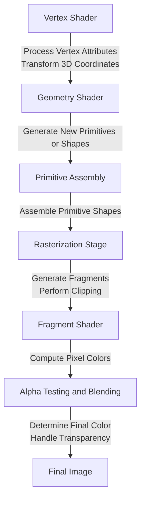

# 1. 入门

## OpenGL

**OpenGL** 一般被认为是一个图形API(Application Programming Interface)，它包含一系列可以操作图形、图像的函数。然而 OpenGL 本身并不是一个 API，它仅仅是由[Khronos组织](http://www.khronos.org/)制定并维护的规范(Specification)，其规定了每个函数的功能和结果，而内部具体的实现细节，将由 OpenGL 库的开发者自行决定。


!!! info "OpenGL 库的开发者一般是显卡厂商，你的显卡支持的OpenGL版本都是专门为这个系列显卡开发的"

早期的 OpenGL 使用立即渲染模式（Immediate mode，固定渲染管线），这个模式容易理解和使用，但是OpenGL的大多数功能都被库隐藏起来，开发者很少有控制OpenGL如何进行计算的自由，导致灵活性和效率太低。因此从OpenGL3.2开始，规范文档开始废弃立即渲染模式，并鼓励开发者在 OpenGL 的核心模式（Core-profile）下进行开发，这个分支的规范完全移除了旧的特性。

在 OpenGL 的核心模式下，当我们试图使用一个已废弃的函数时，OpenGL 会报错并中止绘图，这意味着我们必须使用更现代的函数。现代函数的优势是更高的灵活性和效率，使用者需要真正理解 OpenGL 和图形编程。

!!! note "LearnOpenGL 文档面向 OpenGL3.3 的核心模式"

OpenGL 本身类似一个巨大的状态机，一系列变量描述 OpenGL 此刻应如何运行。OpenGL 的状态通常被称为上下文（Context），我们可以通过设置选项、操作缓冲等操作更改 OpenGL 的状态。

## 绘制第一个三角形！

想要画出我们想要的图形效果，首先要做的是创建一个 OpenGL 的上下文和一个用于显示的窗口。我们可以使用 GLUT、SDL、SFML和GLFW 等库来提供一个窗口和上下文，节省我们写操作系统相关代码的时间。在教程中，我们使用 GLFW 作为演示。

GLFW 库是一个专门针对 OpenGL 的C语言库，它提供了一些渲染物体所需的最低限度的接口，允许用户创建上下文以及简单窗口。


!!! danger "TBD"


OpenGL 的大部分工作是将3D坐标转换为适应你屏幕的2D坐标，这一处理过程由 OpenGL 的图形渲染管线管理：

- <1> 将 3D 坐标转换为 2D 坐标
- <2> 将 2D 坐标转变为有颜色的像素

!!! info "Shader 着色器"
	图形渲染管线从 3D 坐标到像素之间的转换，可以划分为多个可并行执行的阶段，因此对于显卡中上千万的小处理核心，它们在 GPU 上为每一个渲染管线阶段运行各自的着色器，从而快速处理数据。
	
	开发者可以用自己写的着色器代替显卡上默认的着色器，它们运行在 GPU 上，因此可以节省宝贵的 CPU 时间。




对于一个三角形，我们需要指定其三个 3D 顶点，其标准化设备坐标(Normalized Device Coordinates)形式的顶点数组可以定义为：

```c++
float vertices[] =
{
-0.5f, -0.5f, 0.0f,
 0.5f, -0.5f, 0.0f,
 0.0f,  0.5f, 0.0f
};
```

!!! abstract "Normalized Device Coordinates, NDC"
	x、y、z轴坐标都位于 `[-1.0,1.0]` 范围内。通过函数 `glViewport` 函数，标准化设备坐标会转换为屏幕空间坐标(Screen-space Coordinates)，所得的屏幕空间坐标又会被变换为片段输入到片段着色器中。

我们将类似这样的顶点数据发送给渲染管线的第一阶段，顶点着色器。它会在 GPU 上创建一个储存顶点数据的内存(显存)，我们可以通过**顶点缓冲对象**（Vertex Buffer Object，VBO）来管理这个内存。

!!! success "Why VBO?"
	使用缓冲对象的好处是我们可以一次性发送大量顶点数据给显卡，而不是每个顶点发送一次。对于接收 CPU 发来的顶点数据，顶点着色器处理顶点数据是一个相当快的过程。

顶点缓冲对象是我们在 OpenGL 教程中第一个遇到的 OpenGL 对象，我们使用 `glGenBuffers` 函数来生成一个带有缓冲 ID 的 VBO 对象：

```c++
unsigned int VBO;
glGenBuffers(1, &VBO);
```

OpenGL 有很多缓冲对象类型，顶点缓冲对象的类型为 `GL_ARRAY_BUFFER`，我们使用 `glBindBuffer` 函数将新创建的 `VBO` 缓冲绑定到 `GL_ARRAY_BUFFER` 目标上：

```c++
glBindBuffer(GL_ARRAY_BUFFER, VBO);
```

此时我们已经可以用 `VBO` 这个顶点缓冲对象管理显存中的顶点数据。例如，我们可以使用 `glBufferData` 函数将之前定义的顶点数据中复制到缓冲的内存中：

```c++
glBufferData(GL_ARRAY_BUFFER, sizeof(vertices), vertices, GL_STATIC_DRAW);
```

`glBufferData` 是一个专门用来将用户定义的数据复制到当前绑定缓存的函数，第一个参数为缓冲类型，第二个参数为传输数据大小，第三个参数为实际数据，第四个参数制定了显卡如何管理给定的数据：

- `GL_STATIC_DRAW`：数据不会或几乎不会改变
- `GL_DYNAMIC_DRAW`：数据会改变很多
- `GL_STREAM_DRAW`：数据每次绘制时都会改变

对于我们要画的一个简单三角形，每次调用渲染时三角形位置都保持原样，因此使用 `GL_STATIC_DRAW` 即可。

### 顶点着色器

下面我们将创建一个顶点着色器和片段着色器来真正处理这些数据。

顶点着色器(Vertex Shader)是几个可编程着色器中的一个。如果我们打算做渲染的话，现代OpenGL需要我们至少设置一个顶点和一个片段着色器。

我们需要做的第一件事是用着色器语言GLSL(OpenGL Shading Language)编写顶点着色器，然后编译这个着色器，这样我们就可以在程序中使用它了。以下为一个非常基础的GLSL顶点着色器的源代码：

```c++
// 版本声明：OpenGL 3.3，核心模式
#version 330 core
layout (location = 0) in vec3 aPos;

void main()
{
    gl_Position = vec4(aPos.x, aPos.y, aPos.z, 1.0);
}
```

为了编译着色器，我们需要将着色器源代码存储在C风格字符串中，在运行过程中动态编译它：

```c++
int main()
{
    // 初始化GLFW
    if (!glfwInit())
    {
        std::cout << "Failed to initialize GLFW" << std::endl;
        return -1;
    }

    // 创建一个窗口
    GLFWwindow* window = glfwCreateWindow(800, 600, "LearnOpenGL", NULL, NULL);
    if (!window)
    {
        std::cout << "Failed to create GLFW window" << std::endl;
        glfwTerminate();
        return -1;
    }
    glfwMakeContextCurrent(window);

    // 初始化GLAD
    if (!gladLoadGLLoader((GLADloadproc)glfwGetProcAddress))
    {
        std::cout << "Failed to initialize GLAD" << std::endl;
        return -1;
    }

    // 顶点着色器源代码
    const char* vertexShaderSource = "#version 330 core\n"
        "layout (location = 0) in vec3 aPos;\n"
        "void main()\n"
        "{\n"
        "   gl_Position = vec4(aPos.x, aPos.y, aPos.z, 1.0);\n"
        "}\0";

    unsigned int vertexShader; // 着色器对象通过 ID 来引用，因此定义为 unsigned int
    vertexShader = glCreateShader(GL_VERTEX_SHADER); // 创建一个顶点着色器对象

    glShaderSource(vertexShader, 1, &vertexShaderSource, NULL); // 把着色器源码附加到着色器对象上
    glCompileShader(vertexShader); // 编译着色器

    int success;       // 是否编译成功
    char infoLog[512]; // 报错信息

    glGetShaderiv(vertexShader, GL_COMPILE_STATUS, &success); // 检查是否编译成功
    if (!success)
    {
        glGetShaderInfoLog(vertexShader, 512, NULL, infoLog); // 获取错误信息
        std::cout << "ERROR::SHADER::VERTEX::COMPILATION_FAILED\n" << infoLog << std::endl;
    }
    else
        std::cout << "Vertex shader compiled successfully" << std::endl;

    // 清理并退出
    glfwDestroyWindow(window);
    glfwTerminate();
    return 0;
}
```

!!! note "着色器编译要在 GLFW 和 GLAD 都初始化完的基础上"

### 片段着色器

片段着色器用于计算像素的颜色并输出。在计算机图形中，颜色可被表示为四元向量，包括红色、绿色、蓝色、透明度分量，通常缩写为 RGBA。在 OpenGL 或 GLSL 中，每个分量的强度介于 0.0 到 1.0 之间。

以下是一个一直输出完全不透明橘黄色的简单片段着色器：

```c++
#version 330 core
out vec4 FragColor;

void main()
{
    FragColor = vec4(1.0f, 0.5f, 0.2f, 1.0f);
} 
```

其编译过程和顶点着色器步骤相同，此处不再展示。

```c++
// 可能用到的函数
const char* fragmentShaderSource = "#version 330 core\n"
"out vec4 FragColor;\n"
"void main()\n"
"{\n"
"   FragColor = vec4(1.0f, 0.5f, 0.2f, 1.0f);\n"
"}\0";

unsigned int fragmentShader;
fragmentShader = glCreateShader(GL_FRAGMENT_SHADER);
glShaderSource(fragmentShader, 1, &fragmentShaderSource, NULL);
glCompileShader(fragmentShader);
```

当然，你也可以在片段着色器中定义一个 `uniform` 类型的变量，它是一个独一无二的全局变量，可以被任意着色器任意阶段访问。

我们使用 `uniform` 来实现渐变颜色效果：

```c++
// 片段着色器源代码
const char* fragmentShaderSource = "#version 330 core\n"
"uniform vec4 ourColor;"
"out vec4 FragColor;\n"
"void main()\n"
"{\n"
"   FragColor = ourColor;\n"
"}\0";

/* 渲染指令，位于 render loop 中 */
double timeValue = glfwGetTime();
GLfloat redValue = (sin(timeValue) / 2) + 0.5;
GLfloat greenValue = (sin(timeValue + 2.0f) / 2) + 0.5;
GLfloat blueValue = (sin(timeValue + 4.0f) / 2) + 0.5;
GLint vertexColorLocation = glGetUniformLocation(shaderProgram, "ourColor");

glUseProgram(shaderProgram);

glUniform4f(vertexColorLocation, redValue, greenValue, blueValue, 1.0f);

glBindVertexArray(VAO);
glDrawElements(GL_TRIANGLES, 6, GL_UNSIGNED_INT, 0);
```

### 着色器程序对象

在编译完上述两个着色器，我们还需要一个**着色器程序对象**将两个着色器对象链接到一起。

着色器程序对象（Shader Program Object）是多个着色器合并之后并最终链接完成的版本。已激活着色器程序的着色器将在我们发起渲染调用的时候被使用。

我们使用 `glCreateProgram` 函数来创建一个着色器程序对象，并返回其 ID 引用，然后将着色器附加到程序对象上并链接：

```c++
unsigned int shaderProgram;
shaderProgram = glCreateProgram();

glAttachShader(shaderProgram, vertexShader);
glAttachShader(shaderProgram, fragmentShader);
glLinkProgram(shaderProgram);

glUseProgram(shaderProgram);

glDeleteShader(vertexShader);
glDeleteShader(fragmentShader);
```

!!! note "类似着色器编译，同样可以检测链接操作是否失败"
	```c++	
	glGetProgramiv(shaderProgram, GL_LINK_STATUS, &success);
	if(!success) {
	    glGetProgramInfoLog(shaderProgram, 512, NULL, infoLog);
	    ...
	}
	```

使用 `glUseProgram` 函数来激活程序对象，此后每个着色器调用和渲染调用都会使用这个程序对象。把着色器对象链接到程序对象后，就可以删除着色器对象了。

### 链接顶点属性

顶点着色器允许我们指定输入的顶点格式，这具有非常强的灵活性。但是，这也意味着我们需要手动指定输入数据的哪一部分对应着色器哪个顶点属性。假定一个顶点缓冲数据的结构如下：

![[顶点缓冲数据结构.png]]

- 每个位置数据为 4 字节大小的浮点值
- 每个 Vertex 包含三个位置数据
- 在这三个值中没有空隙，即它们在数组中**紧密排列**。
- 数据中第一个值位于缓冲开始的位置

根据以上这些信息，我们通过 `glVertexAttribPointer` 函数来告诉 OpenGL 如何解析该顶点数据：

```c++
glVertexAttribPointer(0, 3, GL_FLOAT, GL_FALSE, 3 * sizeof(float), (void*)0);
glEnableVertexAttribArray(0);
```

- **参数一：** 顶点属性，对应顶点着色器中的 `layout(location=0)`
- **参数二：** 顶点属性的大小(个数？)，顶点属性是一个 `vec3`，由三个值组成，因此设置为 3
- **参数三：** 数据类型，设置为浮点值
- **参数四：** 是否希望数据被标准化。设置 `GL_FALSE` 则不修改数据，如果为 `GL_TRUE`：
	- 对于无符号数，数据被映射到 `[0,1]` 之间
	- 对于有符号数，数据被映射到 `[-1,1]` 之间
- **参数五：** 步长，两组顶点属性起始位置的间隔，本例中差值为 3 个 float 大小
	- 对于紧密排列的顶点属性，可以设置为 0 来让 OpenGL 来决定具体步长
- **参数六：** 数据在缓冲起始位置的偏移，需要强制类型转换为 `void*`

使用 `glEnableVertexAttribArray` 函数来启用顶点属性，其参数为顶点属性位置值（上面的参数一）。至此，我们可以用如下简化步骤来绘制一个物体：

```c++
// 0. 复制顶点数组到缓冲中供OpenGL使用
glBindBuffer(GL_ARRAY_BUFFER, VBO);
glBufferData(GL_ARRAY_BUFFER, sizeof(vertices), vertices, GL_STATIC_DRAW);
// 1. 设置顶点属性指针
glVertexAttribPointer(0, 3, GL_FLOAT, GL_FALSE, 3 * sizeof(float), (void*)0);
glEnableVertexAttribArray(0);
// 2. 当我们渲染一个物体时要使用着色器程序
glUseProgram(shaderProgram);
// 3. 绘制物体
someOpenGLFunctionThatDrawsOurTriangle();
```

但是绘制每一个物体都需要重复上述步骤，我们需要对每个物体各自配置所有顶点属性，这显然是不可取的。因此，我们可以将这些状态配置存储在一个对象中，并且通过绑定这个对象来恢复状态，这就是顶点数组对象（Vertex Array Object，VAO）

!!! warning "OpenGL 的核心模式要求我们使用 VAO"

顶点数组对象可以像顶点缓冲对象一样被绑定，随后任何顶点属性调用都会存储在 VAO 中。这样的好处在于，当配置顶点属性指针时，只需要将调用执行一次，之后再绘制物体时只需要绑定相应 VAO 即可。

一个 VAO 会存储以下内容：

- `glEnableVertexAttribArray` 和 `glDisableVertexAttribArray` 的调用
- 通过 `glVertexAttribPointer` 设置的顶点属性配置
- 通过 `glVertexAttribPointer` 调用与顶点属性相关联的顶点缓冲对象

使用 VAO 的绘制步骤可以简化如下：

```c++
// ..:: 初始化代码（只运行一次 (除非你的物体频繁改变)） :: ..
// 1. 初始化 & 绑定VAO
unsigned int VAO;
glGenVertexArrays(1, &VAO);
glBindVertexArray(VAO);
// 2. 把顶点数组复制到缓冲中供OpenGL使用
glBindBuffer(GL_ARRAY_BUFFER, VBO);
glBufferData(GL_ARRAY_BUFFER, sizeof(vertices), vertices, GL_STATIC_DRAW);
// 3. 设置顶点属性指针
glVertexAttribPointer(0, 3, GL_FLOAT, GL_FALSE, 3 * sizeof(float), (void*)0);
glEnableVertexAttribArray(0);

[...]

// ..:: 绘制代码（渲染循环中） :: ..
// 4. 绘制物体
glUseProgram(shaderProgram);
glBindVertexArray(VAO);
someOpenGLFunctionThatDrawsOurTriangle();
```

终于能画出一个三角形啦！

```c++
#include <glad/glad.h>
#include <GLFW/glfw3.h>
#include <iostream>

/*
* glad头文件包含了正确的OpenGL头文件，例如GL/gl.h，所以GLFW库应该在glad.h之后被包含
*/

// 顶点着色器源代码
const char* vertexShaderSource = "#version 330 core\n"
"layout (location = 0) in vec3 aPos;\n"
"void main()\n"
"{\n"
"   gl_Position = vec4(aPos.x, aPos.y, aPos.z, 1.0);\n"
"}\0";

// 片段着色器源代码
const char* fragmentShaderSource = "#version 330 core\n"
"out vec4 FragColor;\n"
"void main()\n"
"{\n"
"   FragColor = vec4(1.0f, 0.5f, 0.2f, 1.0f);\n"
"}\0";

// 三角形顶点数据
const float vertices[] =
{
-0.5f, -0.5f, 0.0f,
 0.5f, -0.5f, 0.0f,
 0.0f,  0.5f, 0.0f
};

// 窗口大小改变时的回调函数
void framebuffer_size_callback(GLFWwindow* window, int width, int height)
{
	glViewport(0, 0, width, height); // 设置视口大小
}

// 处理输入
void processInput(GLFWwindow* window)
{
	if (glfwGetKey(window, GLFW_KEY_ESCAPE) == GLFW_PRESS) // 按下 ESC 键
		glfwSetWindowShouldClose(window, true);            // 设置窗口关闭
}

int main(void)
{
	glfwInit(); // 初始化 glfw

	// 使用 glfwWindowHint 函数来配置GLFW，第一个参数代表选项的名称，第二个参数接受一个整形，用来设置这个选项的值
	glfwWindowHint(GLFW_CONTEXT_VERSION_MAJOR, 3); // 主版本号为 3
	glfwWindowHint(GLFW_CONTEXT_VERSION_MINOR, 3); // 次版本号为 3
	glfwWindowHint(GLFW_OPENGL_PROFILE, GLFW_OPENGL_CORE_PROFILE); // 使用核心模式

#ifdef __APPLE__
	glfwWindowHint(GLFW_OPENGL_FORWARD_COMPAT, GL_TRUE); // 对于 Mac OS X，需要设置这个选项
#endif

	GLFWwindow* window = glfwCreateWindow(800, 600, "Hello, World!", NULL, NULL); // 创建窗口
	if (window == NULL)
	{
		std::cout << "Failed to create a GLFW window" << "\n";
		glfwTerminate(); // 终止 glfw
		return -1;
	}
	glfwMakeContextCurrent(window); // 将窗口的上下文设置为当前线程的主上下文
	glfwSetFramebufferSizeCallback(window, framebuffer_size_callback); // 每当窗口调整大小时，调用回调函数

	if (!gladLoadGLLoader((GLADloadproc)glfwGetProcAddress)) // 初始化 GLAD
	{
		std::cout << "Failed to initialize GLAD" << "\n";
		return -1;
	}

	// 顶点着色器编译
	unsigned int vertexShader; // 着色器对象通过 ID 来引用，因此定义为 unsigned int
	vertexShader = glCreateShader(GL_VERTEX_SHADER); // 创建一个顶点着色器对象

	glShaderSource(vertexShader, 1, &vertexShaderSource, NULL); // 把着色器源码附加到着色器对象上
	glCompileShader(vertexShader); // 编译着色器

	// 片段着色器编译
	unsigned int fragmentShader; // 创建一个片段着色器对象
	fragmentShader = glCreateShader(GL_FRAGMENT_SHADER); // 创建一个片段着色器对象

	glShaderSource(fragmentShader, 1, &fragmentShaderSource, NULL); // 把着色器源码附加到着色器对象上
	glCompileShader(fragmentShader); // 编译着色器

	// 着色器程序
	unsigned int shaderProgram;
	shaderProgram = glCreateProgram();

	// 把着色器附加到程序对象上，并链接它们
	glAttachShader(shaderProgram, vertexShader);
	glAttachShader(shaderProgram, fragmentShader);
	glLinkProgram(shaderProgram);

	glUseProgram(shaderProgram);

	// 删除着色器对象
	glDeleteShader(vertexShader);
	glDeleteShader(fragmentShader);

	unsigned int VAO, VBO;
	glGenVertexArrays(1, &VAO); // 生成一个 VAO 对象
	glGenBuffers(1, &VBO); // 生成一个 VBO 对象

	// ..:: 初始化代码（只运行一次 (除非你的物体频繁改变)） :: ..
	// 1. 绑定VAO
	glBindVertexArray(VAO);
	// 2. 把顶点数组复制到缓冲中供OpenGL使用
	glBindBuffer(GL_ARRAY_BUFFER, VBO);
	glBufferData(GL_ARRAY_BUFFER, sizeof(vertices), vertices, GL_STATIC_DRAW);
	// 3. 设置顶点属性指针
	glVertexAttribPointer(0, 3, GL_FLOAT, GL_FALSE, 3 * sizeof(float), (void*)0);
	glEnableVertexAttribArray(0);

	// render loop
	while (!glfwWindowShouldClose(window)) // 当窗口没有关闭时
	{
		processInput(window); // 处理输入

		// 设置每次循环开始前清空上一次迭代的渲染结果
		glClearColor(0.2f, 0.3f, 0.3f, 1.0f); // 设置清空屏幕所用的颜色
		glClear(GL_COLOR_BUFFER_BIT); // 清空颜色缓冲
		
		/* 渲染指令 */
		glUseProgram(shaderProgram);
		glBindVertexArray(VAO);
		glDrawArrays(GL_TRIANGLES, 0, 3);

		glfwSwapBuffers(window); // 交换颜色缓冲
		glfwPollEvents(); // 检查有没有触发什么事件
	}

	glDeleteVertexArrays(1, &VAO);
	glDeleteBuffers(1, &VBO);
	glDeleteBuffers(1, &EBO);
	glDeleteProgram(shaderProgram);

	glfwTerminate(); // 终止 glfw，释放资源
	return 0;
}
```


### 元素缓冲对象

元素缓冲对象（Element Buffer Object，EBO），也叫索引缓冲对象（Index Buffer Object, IBO）。假设我们想要绘制一个由两个三角形组成的矩形，其顶点集有以下结构：

```c++
float vertices[] = {
    // 第一个三角形
    0.5f, 0.5f, 0.0f,   // 右上角
    0.5f, -0.5f, 0.0f,  // 右下角
    -0.5f, 0.5f, 0.0f,  // 左上角
    // 第二个三角形
    0.5f, -0.5f, 0.0f,  // 右下角
    -0.5f, -0.5f, 0.0f, // 左下角
    -0.5f, 0.5f, 0.0f   // 左上角
}
```

可以看到右下角和左上角的位置各自重复定义了两个顶点，实际上我们只需要矩形的四个顶点就够了。解决方法就是只储存不同的顶点，并设定绘制这些顶点的顺序，这就是元素缓冲区对象的工作方式。

EBO 是一个缓冲区，它存储 OpenGL 用来决定要绘制哪些顶点的索引，称为**索引绘制**。

```c++
float vertices[] = {
    0.5f, 0.5f, 0.0f,   // 右上角
    0.5f, -0.5f, 0.0f,  // 右下角
    -0.5f, -0.5f, 0.0f, // 左下角
    -0.5f, 0.5f, 0.0f   // 左上角
};

unsigned int indices[] = {
    // 注意索引从0开始! 
    // 此例的索引(0,1,2,3)就是顶点数组vertices的下标，
    // 这样可以由下标代表顶点组合成矩形

    0, 1, 3, // 第一个三角形
    1, 2, 3  // 第二个三角形
};
```

EBO 的创建和数据复制和 VBO 类似，需要注意的是其缓冲类型定义为 `GL_ELEMENT_ARRAY_BUFFER` ：

```c++
unsigned int EBO;
glGenBuffers(1, &EBO);

glBindBuffer(GL_ELEMENT_ARRAY_BUFFER, EBO);
glBufferData(GL_ELEMENT_ARRAY_BUFFER, sizeof(indices), indices, GL_STATIC_DRAW);
```

同样，EBO 可以绑定在 EAO 上，使用 EBO 的初始化和渲染代码结构可以简化如下：

```c++
// ..:: 初始化代码 :: ..
unsigned int VAO, VBO, EBO;
glGenVertexArrays(1, &VAO); // 生成一个 VAO 对象
glGenBuffers(1, &VBO); // 生成一个 VBO 对象
glGenBuffers(1, &EBO); // 生成一个 EBO 对象
// 1. 绑定顶点数组对象
glBindVertexArray(VAO);
// 2. 把我们的顶点数组复制到一个顶点缓冲中，供OpenGL使用
glBindBuffer(GL_ARRAY_BUFFER, VBO);
glBufferData(GL_ARRAY_BUFFER, sizeof(vertices), vertices, GL_STATIC_DRAW);
// 3. 复制我们的索引数组到一个索引缓冲中，供OpenGL使用
glBindBuffer(GL_ELEMENT_ARRAY_BUFFER, EBO);
glBufferData(GL_ELEMENT_ARRAY_BUFFER, sizeof(indices), indices, GL_STATIC_DRAW);
// 4. 设定顶点属性指针
glVertexAttribPointer(0, 3, GL_FLOAT, GL_FALSE, 3 * sizeof(float), (void*)0);
glEnableVertexAttribArray(0);

[...]

// ..:: 绘制代码（渲染循环中） :: ..
glUseProgram(shaderProgram);
glBindVertexArray(VAO);
glDrawElements(GL_TRIANGLES, 6, GL_UNSIGNED_INT, 0);
glBindVertexArray(0);
```

!!! tip "用 `glDrawArrays` 函数达成同样效果"
	```c++
	float vertices[] = {
	// 第一个三角形
	0.5f, 0.5f, 0.0f,   // 右上角
	0.5f, -0.5f, 0.0f,  // 右下角
	-0.5f, 0.5f, 0.0f,  // 左上角
	// 第二个三角形
	0.5f, -0.5f, 0.0f,  // 右下角
	-0.5f, -0.5f, 0.0f, // 左下角
	-0.5f, 0.5f, 0.0f   // 左上角
	};
	// 代替 glDrawElements(GL_TRIANGLES, 6, GL_UNSIGNED_INT, 0);
	glDrawArrays(GL_TRIANGLES, 0, 3); // 第一个三角形
	glDrawArrays(GL_TRIANGLES, 3, 3); // 第二个三角形
	```

## 着色器

在三角形绘制部分中，我们只是简单的写了两个最基本的着色器。本节将会更详细地介绍它们。

### GLSL

着色器使用 GLSL 语言编写，它包含一些针对向量和矩阵操作的有用特性。

一个典型的着色器有如下结构：

```c++
#version version_number
in type in_variable_name;
in type in_variable_name;

out type out_variable_name;

uniform type uniform_name;

void main()
{
  // 处理输入并进行一些图形操作
  ...
  // 输出处理过的结果到输出变量
  out_variable_name = weird_stuff_we_processed;
}
```

GLSL 中包含 `int`,`float`,`double`,`uint`,`bool` 等基础数据类型。并且，它拥有向量和矩阵两种容器类型。

GLSL 的向量是一个可以包含 2,3或4 个分量的容器，分量的数据类型可以是前面提到的任意基础数据类型，写作下面的形式：

|类型|含义|
|---|---|
|`vecn`|包含`n`个float分量的默认向量|
|`bvecn`|包含`n`个bool分量的向量|
|`ivecn`|包含`n`个int分量的向量|
|`uvecn`|包含`n`个unsigned int分量的向量|
|`dvecn`|包含`n`个double分量的向量|

!!! note "大多数情况下，`vecn` 就可以满足要求"

向量一些操作如下：

```c++
// vec4 vec = (vec.x, vec.y, vec.z, vec.w)
vec2 someVec;
vec4 differentVec = someVec.xyxx;
vec3 anotherVec = differentVec.zyw;
vec4 otherVec = someVec.xxxx + anotherVec.yxzy;

vec2 vect = vec2(0.5, 0.7);
vec4 result = vec4(vect, 0.0, 0.0);
vec4 otherResult = vec4(result.xyz, 1.0);
```

`in` 和 `out` 关键字专门用于实现着色器的输入和输出，只要一个输出变量的类型和名称和下一阶段的着色器输入匹配，该变量就会一直传递下去。但在顶点和片段着色器中略有不同。

顶点着色器接收特殊形式的输入，它从顶点数据中直接接收输入，我们使用 `location` 元数据来管理顶点数据。因此，顶点着色器需要为它的输入提供一个额外的 `layout` 标识，使得链接阶段能够将其链接到顶点数据。

!!! info "片段着色器需要一个 `vec4` 的输出变量，如果没有定义颜色输出，则默认渲染为黑色"

例如，我们可以稍微改动以下前面定义的着色器，展示着色器之间的数据交流：

```c++
// vertex shader
#version 330 core
layout (location = 0) in vec3 aPos; // 位置变量的属性位置值为0

out vec3 vertexColor; // 为片段着色器指定一个颜色输出

void main()
{
    gl_Position = vec4(aPos, 1.0);
    vertexColor = vec3(0.5, 0.0, 0.0); // 把输出变量设置为暗红色
}


// fragment shader
#version 330 core
out vec4 FragColor;

in vec3 vertexColor; // 从顶点着色器传来的输入变量（名称相同、类型相同）

void main()
{
    FragColor = vec4(vertexColor, 1.0f);
}
```

**Uniform** 是另一种从我们的应用程序在 CPU 上传递数据到 GPU 上的着色器的方式，它是一种全局变量，必须在每个着色器程序对象中都是独一无二的，而且它可以被着色器程序的任意着色器在任意阶段访问。无论你把 uniform 值设置成什么，uniform 会一直保存它们的数据，直到它们被重置或更新。

```c++
#version 330 core
out vec4 FragColor;

uniform vec4 ourColor; // 在OpenGL程序代码中设定这个变量

void main()
{
    FragColor = ourColor;
}
```

因为 uniform 是全局变量，我们可以在任何着色器中定义它们，而无需通过顶点着色器作为中介。顶点着色器中不需要这个 uniform，所以我们不用在那里定义它。

!!! warning "静默移除"
	如果你声明了一个 uniform 却在GLSL代码中没用过，编译器会静默移除这个变量，导致最后编译出的版本中并不会包含它，这可能导致几个非常麻烦的错误，记住这点！

这个 uniform 现在还是空的；我们还没有给它添加任何数据，所以下面我们就做这件事。我们首先需要找到着色器中 uniform 属性的索引/位置值。当我们得到 uniform 的索引/位置值后，我们就可以更新它的值了。这次我们不去给像素传递单独一个颜色，而是让它随着时间改变颜色：

```c++
float timeValue = glfwGetTime();
float greenValue = (sin(timeValue) / 2.0f) + 0.5f;
int vertexColorLocation = glGetUniformLocation(shaderProgram, "ourColor");
glUseProgram(shaderProgram);
glUniform4f(vertexColorLocation, 0.0f, greenValue, 0.0f, 1.0f);
```

首先我们通过 `glfwGetTime` 函数获取运行的秒数。然后我们使用sin函数让颜色在 0.0 到 1.0 之间改变，最后将结果储存到 greenValue 里。

接着，我们用 `glGetUniformLocation` 查询 `uniform ourColor` 的位置值。我们为查询函数提供着色器程序和 uniform 的名字。如果 `glGetUniformLocation` 返回 `-1` 就代表没有找到这个位置值。最后，我们可以通过 `glUniform4f` 函数设置 uniform 值。注意，查询 uniform 地址不要求你之前使用过着色器程序，但是更新一个 uniform 之前你**必须**先使用程序（调用glUseProgram)，因为它是在当前激活的着色器程序中设置 uniform 的。

### 着色器类

```c++
// shader_s.hpp

#ifndef SHADER_H
#define SHADER_H

#include <glad/glad.h>

#include <string>
#include <fstream>
#include <sstream>
#include <iostream>

class Shader
{
public:
    unsigned int ID;
    // constructor generates the shader on the fly
    // ------------------------------------------------------------------------
    Shader(const char* vertexPath, const char* fragmentPath)
    {
        // 1. retrieve the vertex/fragment source code from filePath
        std::string vertexCode;
        std::string fragmentCode;
        std::ifstream vShaderFile;
        std::ifstream fShaderFile;
        // ensure ifstream objects can throw exceptions:
        vShaderFile.exceptions(std::ifstream::failbit | std::ifstream::badbit);
        fShaderFile.exceptions(std::ifstream::failbit | std::ifstream::badbit);
        try
        {
            // open files
            vShaderFile.open(vertexPath);
            fShaderFile.open(fragmentPath);
            std::stringstream vShaderStream, fShaderStream;
            // read file's buffer contents into streams
            vShaderStream << vShaderFile.rdbuf();
            fShaderStream << fShaderFile.rdbuf();
            // close file handlers
            vShaderFile.close();
            fShaderFile.close();
            // convert stream into string
            vertexCode = vShaderStream.str();
            fragmentCode = fShaderStream.str();
        }
        catch (std::ifstream::failure& e)
        {
            std::cout << "ERROR::SHADER::FILE_NOT_SUCCESSFULLY_READ: " << e.what() << std::endl;
        }
        const char* vShaderCode = vertexCode.c_str();
        const char* fShaderCode = fragmentCode.c_str();
        // 2. compile shaders
        unsigned int vertex, fragment;
        // vertex shader
        vertex = glCreateShader(GL_VERTEX_SHADER);
        glShaderSource(vertex, 1, &vShaderCode, NULL);
        glCompileShader(vertex);
        checkCompileErrors(vertex, "VERTEX");
        // fragment Shader
        fragment = glCreateShader(GL_FRAGMENT_SHADER);
        glShaderSource(fragment, 1, &fShaderCode, NULL);
        glCompileShader(fragment);
        checkCompileErrors(fragment, "FRAGMENT");
        // shader Program
        ID = glCreateProgram();
        glAttachShader(ID, vertex);
        glAttachShader(ID, fragment);
        glLinkProgram(ID);
        checkCompileErrors(ID, "PROGRAM");
        // delete the shaders as they're linked into our program now and no longer necessary
        glDeleteShader(vertex);
        glDeleteShader(fragment);
    }
    // activate the shader
    // ------------------------------------------------------------------------
    void use()
    {
        glUseProgram(ID);
    }
	// delete the shader
	// ------------------------------------------------------------------------
	void DeleteShader()
	{
		glDeleteProgram(ID);
	}

    // utility uniform functions
    // ------------------------------------------------------------------------
    void setBool(const std::string& name, bool value) const
    {
        glUniform1i(glGetUniformLocation(ID, name.c_str()), (int)value);
    }
    // ------------------------------------------------------------------------
    void setInt(const std::string& name, int value) const
    {
        glUniform1i(glGetUniformLocation(ID, name.c_str()), value);
    }
    // ------------------------------------------------------------------------
    void setFloat(const std::string& name, float value) const
    {
        glUniform1f(glGetUniformLocation(ID, name.c_str()), value);
    }
	// ------------------------------------------------------------------------
	void setColor(const std::string& name, float r, float g, float b, float a) const
	{
		glUniform4f(glGetUniformLocation(ID, name.c_str()), r, g, b, a);
	}

private:
    // utility function for checking shader compilation/linking errors.
    // ------------------------------------------------------------------------
    void checkCompileErrors(unsigned int shader, std::string type)
    {
        int success;
        char infoLog[1024];
        if (type != "PROGRAM")
        {
            glGetShaderiv(shader, GL_COMPILE_STATUS, &success);
            if (!success)
            {
                glGetShaderInfoLog(shader, 1024, NULL, infoLog);
                std::cout << "ERROR::SHADER_COMPILATION_ERROR of type: " << type << "\n" << infoLog << "\n -- --------------------------------------------------- -- " << std::endl;
            }
        }
        else
        {
            glGetProgramiv(shader, GL_LINK_STATUS, &success);
            if (!success)
            {
                glGetProgramInfoLog(shader, 1024, NULL, infoLog);
                std::cout << "ERROR::PROGRAM_LINKING_ERROR of type: " << type << "\n" << infoLog << "\n -- --------------------------------------------------- -- " << std::endl;
            }
        }
    }
};
#endif
```

在主程序中，使用如下代码创建程序对象以及使用着色器：

```c++
Shader ShaderProgram("shader.vs", "shader.fs");
ShaderProgram.use();

ShaderProgram.use();
ShaderProgram.setColor("ourColor", redValue, greenValue, blueValue, 1.0f);
```

这里我将顶点着色器和片段着色器源代码分别保存在 `shader.vs` 和 `shader.fs` 中，在着色器类中实现读取编译链接。

## 纹理映射

### 纹理配置选项

<font style="font-weight: 1000;font-size: 20px" color="red">1. 纹理环绕方式</font>

纹理坐标范围为 `(0,0)` 到 `(1,1)`，那么如果我们得到的纹理坐标超出这个范围怎么办？OpenGL 的默认处理方式是重复这个纹理部分，即 `GL_REPEAT` 。不过我们可以通过 `glTexParameteri` 函数对单独坐标轴修改环绕方式，达成不同的视觉效果：

```c++
glTexParameteri(GL_TEXTURE_2D, GL_TEXTURE_WRAP_S, GL_MIRRORED_REPEAT);
glTexParameteri(GL_TEXTURE_2D, GL_TEXTURE_WRAP_T, GL_MIRRORED_REPEAT);
```

- **参数一：** 纹理目标。使用的是 2D 纹理
- **参数二：** 配置选项。此处我们需要配置纹理的 WRAP 方式
	- 在纹理坐标中，横着的称为 s 轴，竖着的称为 t 轴
- **参数三：** 环绕方式，具体有以下四种可选：

![[wrappingmethod.png]]

!!! failure "对于 `GL_CLAMP_TO_BORDER`，我们还需要指定一个边缘颜色，使用 `glTexParameterfv`"
	```c++
	float borderColor[] = { 1.0f, 1.0f, 0.0f, 1.0f };
	glTexParameterfv(GL_TEXTURE_2D, GL_TEXTURE_BORDER_COLOR, borderColor);
	```

<font style="font-weight: 1000;font-size: 20px" color="red">2. 纹理过滤</font>

OpenGL 的默认过滤方式是邻近过滤 `GL_NEAREST`，即选择最接近纹理坐标的那个像素的材质。同时，我们也可以将其修改为 `GL_LINEAR` 线性过滤的方式，它会根据纹理坐标与周围像素中心的距离做线性插值，返回混合色，从而实现更加真实的效果。

对于一个非常低分辨率的纹理图，`GL_NEAREST` 和 `GL_LINEAR` 的效果如图：

![[texturefiltermethod.png]]

我们可以对纹理被放大(Magnify)和缩小(Minify)时的两种情况分别设置纹理过滤的选项，例如，以下代码实现纹理缩小时使用邻近过滤，纹理放大时使用线性过滤：

```c++
glTexParameteri(GL_TEXTURE_2D, GL_TEXTURE_MIN_FILTER, GL_NEAREST);
glTexParameteri(GL_TEXTURE_2D, GL_TEXTURE_MAG_FILTER, GL_LINEAR);
```

<font style="font-weight: 1000;font-size: 20px" color="red">3. 多级渐远纹理</font>

对于远处的物体，由于其产生的片段可能较少，从高分辨率纹理中为这些片段获取正确的颜色值较为困难，导致对远处小物体进行的纹理映射效果不真实。

OpenGL 可以使用多级渐远纹理(Mipmap)的方式来解决这个问题，当摄像机离物体超出一定距离的阈值，OpenGL 会使用不同级的多级渐远纹理来进行纹理映射。这能够在保持了渲染效果的同时大大提高性能。

最简单的 Mipmap 就是为前一级纹理图像生成一张 $\frac{1}{2}\times \frac{1}{2}$ 大小的新纹理图像：

![[easiestmipmap.png]]

在渲染中切换多级渐变纹理级别时，可能会产生不真实的生硬边界。就像普通的纹理过滤一样，我们也可以为纹理级别切换时使用不同的过滤方式：

| 过滤方式                        | 描述                               |
| --------------------------- | -------------------------------- |
| `GL_NEAREST_MIPMAP_NEAREST` | 使用最邻近的多级渐远纹理级别，并使用邻近插值进行纹理采样     |
| `GL_LINEAR_MIPMAP_NEAREST`  | 使用最邻近的多级渐远纹理级别，并使用线性插值进行采样       |
| `GL_NEAREST_MIPMAP_LINEAR`  | 在两个邻近的多级渐远纹理之间进行线性插值，使用邻近插值进行采样  |
| `GL_LINEAR_MIPMAP_LINEAR`   | 在两个邻近的多级渐远纹理之间使用线性插值，并使用线性插值进行采样 |

```c++
glTexParameteri(GL_TEXTURE_2D, GL_TEXTURE_MIN_FILTER, GL_LINEAR_MIPMAP_LINEAR);
glTexParameteri(GL_TEXTURE_2D, GL_TEXTURE_MAG_FILTER, GL_LINEAR);
```

!!! note "多级渐远纹理只有当纹理被缩小时有效，因此对于放大选项不应该选择上述四种之一"
	实际上，为放大过滤选项设置多级渐远纹理设置会产生一个 `GL_INVALID_ENUM` 错误代码。

### 加载和创建纹理

`stb_image.h` 是[Sean Barrett](https://github.com/nothings)的一个非常流行的单头文件图像加载库，它能够加载大部分流行的文件格式，并且能够很简单地整合到你的工程之中。

下面的教程中，我们会使用一张[木箱](https://learnopengl-cn.github.io/img/01/06/container.jpg)的图片。要使用 `stb_image.h` 加载图片，我们需要使用它的 `stbi_load` 函数：

```c++
int width, height, nrChannels;
unsigned char *data = stbi_load("container.jpg", &width, &height, &nrChannels, 0);
```

这个函数首先接受一个图像文件的位置作为输入。接下来它需要三个 `int` 作为它的第二、第三和第四个参数，`stb_image.h` 将会用图像的**宽度**、**高度**和**颜色通道的个数**填充这三个变量，这些参数在之后生成纹理时会被用到。

```c++
// 生成纹理对象
unsigned int texture;
glGenTextures(1, &texture);

// 绑定纹理
glBindTexture(GL_TEXTURE_2D, texture);

// 使用前面载入的图片数据生成纹理
glTexImage2D(GL_TEXTURE_2D, 0, GL_RGB, width, height, 0, GL_RGB, GL_UNSIGNED_BYTE, data);
glGenerateMipmap(GL_TEXTURE_2D);
```

- **参数一：** 纹理目标
- **参数二：** 多级渐远纹理的级别。0 对应 base-level
- **参数三：** 纹理存储后的格式。由于此处只需要 RGB 值，因此设置为 `GL_RGB`
- **参数四、五：** 纹理的宽度和高度
- **参数六：** 总为 0，历史遗留问题
- **参数七、八：** 原图的格式和数据类型。此处我们以 RGB 加载图像，并将其存储为 char(Byte) 数组
- **参数九：** 图像数据

当调用 `glTexImage2D` 后，只有 base level 级别的纹理图像被加载。如果要使用多级渐远纹理，可以再后面加一句 `glGenerateMipmap`，它会为参数对应绑定的纹理生成所需要的多级渐远纹理。

最终，生成一个纹理的过程可以简化为：

```c++
unsigned int texture;
glGenTextures(1, &texture);
glBindTexture(GL_TEXTURE_2D, texture);
// 为当前绑定的纹理对象设置环绕、过滤方式
glTexParameteri(GL_TEXTURE_2D, GL_TEXTURE_WRAP_S, GL_REPEAT);   
glTexParameteri(GL_TEXTURE_2D, GL_TEXTURE_WRAP_T, GL_REPEAT);
glTexParameteri(GL_TEXTURE_2D, GL_TEXTURE_MIN_FILTER, GL_LINEAR);
glTexParameteri(GL_TEXTURE_2D, GL_TEXTURE_MAG_FILTER, GL_LINEAR);
// 加载并生成纹理
int width, height, nrChannels;
stbi_set_flip_vertically_on_load(true); // 垂直翻转
unsigned char *data = stbi_load("container.jpg", &width, &height, &nrChannels, 0);
if (data)
{
    glTexImage2D(GL_TEXTURE_2D, 0, GL_RGB, width, height, 0, GL_RGB, GL_UNSIGNED_BYTE, data);
    glGenerateMipmap(GL_TEXTURE_2D);
}
else
{
    std::cout << "Failed to load texture" << std::endl;
}
// 释放图像数据
stbi_image_free(data);
```

!!! note "OpenGL默认忽略透明度 alpha 参数，如果希望渲染透明物体，请加上"
	```c++
	glEnable(GL_BLEND); // 启用混合
	glBlendFunc(GL_SRC_ALPHA, GL_ONE_MINUS_SRC_ALPHA); // 混合函数
	```

在本例中，我们构造的顶点数据结构如下：

```c++
// 三角形顶点数据
float vertices[] = {
		//     ---- 位置 ----       ---- 颜色 ----     - 纹理坐标 -
		 0.5f,  0.5f, 0.0f,   1.0f, 0.0f, 0.0f,   1.0f, 1.0f,   // 右上
		 0.5f, -0.5f, 0.0f,   0.0f, 1.0f, 0.0f,   1.0f, 0.0f,   // 右下
		-0.5f, -0.5f, 0.0f,   0.0f, 0.0f, 1.0f,   0.0f, 0.0f,   // 左下
		-0.5f,  0.5f, 0.0f,   1.0f, 1.0f, 0.0f,   0.0f, 1.0f    // 左上
};

unsigned int indices[] = {
	0, 1, 3, // 第一个三角形
	1, 2, 3  // 第二个三角形
};
```

对应顶点属性指针的设置如下：

```c++
// position attribute
glVertexAttribPointer(0, 3, GL_FLOAT, GL_FALSE, 8 * sizeof(float), (void*)0);
glEnableVertexAttribArray(0);
// color attribute
glVertexAttribPointer(1, 3, GL_FLOAT, GL_FALSE, 8 * sizeof(float), (void*)(3 * sizeof(float)));
glEnableVertexAttribArray(1);
// texture coord attribute
glVertexAttribPointer(2, 2, GL_FLOAT, GL_FALSE, 8 * sizeof(float), (void*)(6 * sizeof(float)));
glEnableVertexAttribArray(2);
```

使用的顶点着色器和片段着色器源码为：

```c++
// shader.vs
#version 330 core

layout (location = 0) in vec3 aPos;
layout (location = 1) in vec3 aColor;
layout (location = 2) in vec2 aTexCoord;

out vec3 ourColor;
out vec2 TexCoord;

void main()
{
    gl_Position = vec4(aPos, 1.0);
    ourColor = aColor;
    TexCoord = aTexCoord;
}

// ------------------------------------------

// shader.fs
#version 330 core
out vec4 FragColor;

in vec3 ourColor;
in vec2 TexCoord;

uniform sampler2D ourTexture;

void main()
{
    FragColor = texture(ourTexture, TexCoord);
}
```

### 纹理单元

在上面的片段着色器中，我们将 Texture 变量定义为 uniform 属性，但是在使用过程中并没有对其进行赋值修改等操作。

这是因为它的默认值是 0，而纹理单元0是默认激活的纹理单元，所以我们不需要对其进行修改。

但是如果我们希望混合两个甚至更多个纹理怎么办呢？OpenGL 保证至少有 16 个纹理单元可以使用，即范围是 `GL_TEXTURE0` 到 `GL_TEXTURE15`。当我们希望使用或映射某一纹理单元对应的纹理时，只需要在 Bind 前使用 `glActiveTexture` 函数将其激活即可：

```c++
glActiveTexture(GL_TEXTURE0); // 在绑定纹理之前先激活纹理单元
glBindTexture(GL_TEXTURE_2D, texture);
```

!!! info "在循环处理中，我们可以很方便的使用 `GL_TEXTURE0 + 8` 代替 `GL_TEXTURE8`"

假定我们的片段着色器源码如下：

```c++
#version 330 core
...

uniform sampler2D texture1;
uniform sampler2D texture2;

void main()
{
    FragColor = mix(texture(texture1, TexCoord), texture(texture2, TexCoord), 0.2);
}
```

!!! note "`mix` 是 GLSL 的内置函数，参数 0.2 说明返回 80% 第一个输入颜色和 20% 第二个输入颜色的混合"

按照先前步骤，我们在主程序中设置并加载两个 texture ID：

```c++
unsigned int texture1, texture2;

	// ..:: 纹理数据加载 :: ..
	// ------------------------------------------------------------
	// 1. 绑定纹理对象
	glBindTexture(GL_TEXTURE_2D, texture1);
	// 2. 设置纹理环绕、过滤方式
	glTexParameteri(GL_TEXTURE_2D, GL_TEXTURE_WRAP_S, GL_REPEAT);
	glTexParameteri(GL_TEXTURE_2D, GL_TEXTURE_WRAP_T, GL_REPEAT);
	glTexParameteri(GL_TEXTURE_2D, GL_TEXTURE_MIN_FILTER, GL_LINEAR);
	glTexParameteri(GL_TEXTURE_2D, GL_TEXTURE_MAG_FILTER, GL_LINEAR);
	// 3. 加载并生成纹理
	int width, height, nrChannels;
	stbi_set_flip_vertically_on_load(true); // 让纹理坐标 y 轴翻转
	unsigned char* data = stbi_load("graph1.jpg", &width, &height, &nrChannels, 0);
	if (data)
	{
		glTexImage2D(GL_TEXTURE_2D, 0, GL_RGB, width, height, 0, GL_RGB, GL_UNSIGNED_BYTE, data);
		glGenerateMipmap(GL_TEXTURE_2D);
	}
	else std::cout << "Failed to load texture" << std::endl;
	stbi_image_free(data);

	// ..:: 纹理数据加载 :: ..
	// ------------------------------------------------------------
	// 1. 绑定纹理对象
	glBindTexture(GL_TEXTURE_2D, texture2);
	// 2. 设置纹理环绕、过滤方式
	[ ... ]
	// 3. 加载并生成纹理
	[ ... ]
```

但是此时着色器中 uniform 的 `texture1` 和 `texture2` 都未赋值，默认指向纹理单元0，我们希望 `texture2` 指向纹理单元1，此处应使用 `glUniform1i` 函数将其值设置为1。这之后就可以激活各个纹理单元并渲染图形：

```c++
ourShader.use(); // 不要忘记在设置uniform变量之前激活着色器程序！
glUniform1i(glGetUniformLocation(ourShader.ID, "texture1"), 0); // 手动设置
ourShader.setInt("texture2", 1); // 或者使用着色器类设置

while(...) 
{
    [...]
	glActiveTexture(GL_TEXTURE0);
	glBindTexture(GL_TEXTURE_2D, texture1);
	glActiveTexture(GL_TEXTURE1);
	glBindTexture(GL_TEXTURE_2D, texture2);

	ourShader.use();
	glBindVertexArray(VAO);
	glDrawElements(GL_TRIANGLES, 6, GL_UNSIGNED_INT, 0);
	[...]
}
```

## 变换

### 齐次坐标系下仿射变换

使用矩阵可以方便、统一的对物体进行各种变换。

!!! info "齐次坐标中，对于 3D 点，$w=1$；对于 3D 向量，$w =0$"

在二维平面下，用齐次坐标分别表示缩放、旋转的矩阵：

**Scale：**

$$
S(s_x, s_y)=\left[\begin{matrix}s_x & 0 & 0 \\ 0 & s_y & 0 \\ 0 & 0 & 1\end{matrix}\right]
$$

**Rotate：**

$$
R(\alpha) = \left[\begin{matrix}\cos \alpha & -\sin \alpha & 0 \\ \sin \alpha & \cos \alpha & 0 \\ 0 & 0 & 1\end{matrix}\right]
$$

**Translation：**

$$
T(t_x, t_y) =\left[\begin{matrix}1 & 0& t_x \\ 0 & 1 & t_y  \\ 0 & 0 & 1\end{matrix}\right]
$$
![[3Dmatrixrotate.png]]

OpenGL 没有自带的矩阵和向量数学知识，但是我们可以使用 [GLM 库](https://glm.g-truc.net/0.9.8/index.html) 。例如，以下代码实现将物体先将物体按照时间旋转，再右移 0.5，下移 0.5（到右下角）。

```c++
glm::mat4 trans = glm::mat4(1.0f);
trans = glm::translate(trans, glm::vec3(0.5f, -0.5f, 0.0f));
trans = glm::rotate(trans, (float)glfwGetTime(), glm::vec3(0.0f, 0.0f, 1.0f));
		
ShaderProgram.setMatrix4("transform", glm::value_ptr(trans));
```

!!! note "注意变换矩阵的应用是从右到左的，因此后乘的会先被加载"

### 坐标系变换

在我们之前的例子中，我们都是直接将物体放置在标准化设备坐标之内来渲染，超出 $[-1,1]^3$ 范围的物体都将不可见。实际应用中，我们需要将原本的坐标系转换为标准化设备坐标，然后将转换后的坐标传入光栅器，再将它们变为屏幕上的二维坐标或像素。

一般来讲，从我们物体的局部坐标到最终得到的屏幕坐标，会经过以下几个变换过程：

![[coordtransformationoverview.png]]

- **局部空间：** 指物体所在的局部空间，每个局部空间的坐标原点参照都可能不同
- **世界空间：** 将各个物体放置在世界坐标系下的空间坐标，通过 Model Matrix 转换得到
	- Model Matrix 能够对物体进行位移、缩放、旋转等操作，使其摆放在正确的位置
- **观察空间：** 有时也被称为摄像机空间或视觉空间，是将世界坐标转换成用户视野的结果，通过 View Matrix 转换得到
- **裁剪空间：** 通过 Projection Matrix 将观察空间内的坐标转换成标准化设备坐标。超出 $[-1,1]$ 的内容将会被裁剪掉
	- 实际使用中，可以选择正交投影(Orthographic)或者透视投影(Perspective)
	- 二者区别在于，正交投影远近平面等大，而透视投影近平面较小，摄像机被看作是一个点

我们可以使用 GLM 内置的函数来创建正交投影矩阵或者透视投影矩阵：

```c++
// Orthographic Projection Matrix
glm::ortho(0.0f, 800.0f, 0.0f, 600.0f, 0.1f, 100.0f);
- 1.2. 左右坐标
- 3.4. 底部顶部坐标
- 5.6. 近平面远平面坐标


// Perspective Projection Matrix
glm::mat4 proj = glm::perspective(glm::radians(45.0f), (float)width/(float)height, 0.1f, 100.0f);
- 1. FOV: field of view
- 2. 宽高比
- 3.4. 近平面远平面坐标 
```

例如，我们可以对物体坐标做出如下变换，使得，其视觉效果就像在地板上一样：

```c++
/** in shader.vs:
gl_Position = projection * view * model * vec4(aPos, 1.0f);
*/

glm::mat4 model = glm::mat4(1.0f);
model = glm::rotate(model, glm::radians(-55.0f), glm::vec3(1.0f, 0.0f, 0.0f));
glm::mat4 view = glm::mat4(1.0f);
view = glm::translate(view, glm::vec3(0.0f, 0.0f, -3.0f));
glm::mat4 projection = glm::mat4(1.0f);
projection = glm::perspective(glm::radians(45.0f), 800.0f / 600.0f, 0.1f, 100.0f);
		
ShaderProgram.setMatrix4("model", glm::value_ptr(model));
ShaderProgram.setMatrix4("view", glm::value_ptr(view));
ShaderProgram.setMatrix4("projection", glm::value_ptr(projection));
```


接下来我们将使用 [3D 物体](https://learnopengl.com/code_viewer.php?code=getting-started/cube_vertices) 来做演示。

此处不采用索引缓冲，直接使用 `glDrawArrays` 画出 12 个三角形：

```c++
// 开启 z 缓冲，但需要在每次循环开头清空 buffer
glEnable(GL_DEPTH_TEST); // 位于第一次着色器程序对象启用之前


// in render loop:
glClear(GL_COLOR_BUFFER_BIT | GL_DEPTH_BUFFER_BIT); // 清空颜色缓冲和深度缓冲

glm::mat4 view = glm::mat4(1.0f);
view = glm::translate(view, glm::vec3(-xoffset, -yoffset, -3.0f));
glm::mat4 projection = glm::mat4(1.0f);
projection = glm::perspective(glm::radians(45.0f), 800.0f / 600.0f, 0.1f, 100.0f);
		
ShaderProgram.setMatrix4("view", glm::value_ptr(view));
ShaderProgram.setMatrix4("projection", glm::value_ptr(projection));

ShaderProgram.use();
glBindVertexArray(VAO);
for (unsigned int i = 0; i < 10; i++)
{
	glm::mat4 model = glm::mat4(1.0f);
	model = glm::translate(model, cubePositions[i]);
	model = glm::rotate(model, (float)glfwGetTime(), glm::vec3(1.0f, 0.3f, 0.5f));
	ShaderProgram.setMatrix4("model", glm::value_ptr(model));

	glDrawArrays(GL_TRIANGLES, 0, 36);
}
```

一次循环渲染十个箱子，箱子的世界坐标偏移由数组 `cubePositions` 确定。

### 摄像机

OpenGL 本身没有摄像机的概念，但是我们可以把场景中的所有物体都往相反方向移动来模拟摄像机的移动。

那么 View Matrix 的作用就是将世界坐标变换为以摄像机为原点的新坐标系。所幸的是，GLM 提供了一种便利的方式生成该变换矩阵：

```c++
glm::mat4 view;
view = glm::lookAt(glm::vec3(0.0f, 0.0f, 3.0f), 
           glm::vec3(0.0f, 0.0f, 0.0f), 
           glm::vec3(0.0f, 1.0f, 0.0f));
```

- **参数一：** 摄像机坐标
- **参数二：** 看向目标的坐标
- **参数三：** 摄像机的上向量，用来确定视角方向

据此，我们可以利用 `glfwGetTime` 函数来搞一点花样：

```c++
float radius = 10.0f;
float camX = sin(glfwGetTime()) * radius;
float camZ = cos(glfwGetTime()) * radius;
glm::mat4 view;
view = glm::lookAt(glm::vec3(camX, 0.0, camZ), glm::vec3(0.0, 0.0, 0.0), glm::vec3(0.0, 1.0, 0.0)); 
```

![[glfwtimerotationwithcamera.gif]]

我们当然可以使用键盘鼠标等输入自由操控摄像机的移动，为了简化步骤，我们定义如下几个摄像机向量：

```c++
glm::vec3 cameraPos   = glm::vec3(0.0f, 0.0f,  3.0f);
glm::vec3 cameraFront = glm::vec3(0.0f, 0.0f, -1.0f); // 摄像机方向
glm::vec3 cameraUp    = glm::vec3(0.0f, 1.0f,  0.0f);

view = glm::lookAt(cameraPos, cameraPos + cameraFront, cameraUp);
```

!!! tip "使用 `cameraFront` 确定方向，这样就算修改 `cameraPos`，视角方向也不会变"

在 `processInput` 函数中，我们添加按键命令实现 wasd 控制摄像机：

```c++
void processInput(GLFWwindow *window)
{
    ...
    float cameraSpeed = 2.5f * deltaTime;
    if (glfwGetKey(window, GLFW_KEY_W) == GLFW_PRESS)
        cameraPos += cameraSpeed * cameraFront;
    if (glfwGetKey(window, GLFW_KEY_S) == GLFW_PRESS)
        cameraPos -= cameraSpeed * cameraFront;
    if (glfwGetKey(window, GLFW_KEY_A) == GLFW_PRESS)
        cameraPos -= glm::normalize(glm::cross(cameraFront, cameraUp)) * cameraSpeed;
    if (glfwGetKey(window, GLFW_KEY_D) == GLFW_PRESS)
        cameraPos += glm::normalize(glm::cross(cameraFront, cameraUp)) * cameraSpeed;
}
```

!!! info "deltaTime"
	由于不同用户设备原因，每秒渲染的帧数可能不一致，导致 `processInput` 每秒调用的次数也不同。为了让所有用户的摄像机移动速度相同，我们需要使用 $\Delta T$ 来作为相机移动速度的量度。
	
	```c++
	// in render loop
	float currentFrame = glfwGetTime();
	deltaTime = currentFrame - lastFrame;
	lastFrame = currentFrame;
	```

只用键盘操控还不够有意思，我们希望能够加入鼠标控制，实现类似 FPS 游戏的效果！

我们用欧拉角表示 3D 空间中的三个旋转值：

![[eularanglerotation.png]]

- **俯仰角 Pitch：** 描述如何向上或向下看，平面与 y 轴平行
- **偏航角 Yaw：** 描述如何向左或向右看，平面与 y 轴垂直
	- 其大小为与 x 轴的夹角
- **滚转角 Roll：** 描述摄像机如何翻滚，平面与 z 轴垂直

此处我们只需关心 Pitch 和 Yaw 的处理，根据三角学的知识，我们可以得到对于单位方向向量，其 xyz 分量为：

```c++
direction.x = cos(glm::radians(pitch)) * cos(glm::radians(yaw));
direction.y = sin(glm::radians(pitch));
direction.z = cos(glm::radians(pitch)) * sin(glm::radians(yaw));
```

Pitch 和 Yaw 可以从上一帧鼠标的位置和这一帧鼠标位置的比对得到。我们首先应该告诉 GLFW 我们需要捕获鼠标，该操作仍然通过函数设置状态机完成：

```c++
glfwSetInputMode(window, GLFW_CURSOR, GLFW_CURSOR_DISABLED);
```

为了监听鼠标位置，我们额外设置一个回调函数 `mouse_callback` ，每当鼠标被移动时都会调用该函数：

```c++
glfwSetCursorPosCallback(window, mouse_callback);

// xpox, ypos 为当前鼠标位置
void mouse_callback(GLFWwindow* window, double xpos, double ypos)
{
	if(firstMouse) // 这个bool变量初始时是设定为true的
	{
	    lastX = xpos;
	    lastY = ypos;
	    firstMouse = false;
	    return;
	}

	float xoffset = xpos - lastX;
	float yoffset = lastY - ypos; // 鼠标向上移动，ypos 减小
	lastX = xpos;
	lastY = ypos;

	float sensitivity = 0.05f; // 灵敏度
	xoffset *= sensitivity;
	yoffset *= sensitivity;

	yaw += xoffset;
	pitch += yoffset;

	if (pitch > 89.0f)
		pitch = 89.0f;
	if (pitch < -89.0f)
		pitch = 89.0f;

	glm::vec3 front;
	front.x = cos(glm::radians(pitch)) * cos(glm::radians(yaw));
	front.y = sin(glm::radians(pitch));
	front.z = cos(glm::radians(pitch)) * sin(glm::radians(yaw));
	cameraFront = glm::normalize(front);
}
```

